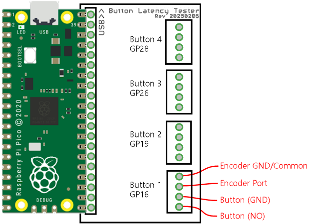

# Button Latency Tester II Connector Board

This is an EAGLE design for a simple connector board for the Button
Latency Tester II software.  It implements the sample circuit plan
shown in the project page for connecting buttons to the BLT-II Pico
and the subject device (the button encoder device you're testing for
latency timing), using optocouplers for simultaneous triggering on
both devices.  The board provides wiring for up to four physical
buttons.

Each button has a four-pin connector, designed to accommodate a
Phoenix Contact MPT 0,5 screw terminal (MPT 0,5/4-2,54, part number 1725672).
I chose screw terminals because they're the easiest type of connector
to wire for temporary connections (fitting this board's mission as
a testing tool).  Plus, many of popular key/button encoder boards use
these same screw terminals, or something very much like them, so this
should make it easy to move your existing wiring over from an encoder
that's already installed in a pin cab.

## Connection diagram

## Pico installation

The Pico should be installed face-up as shown in the diagram.  The
board is designed to hold a 20-pin, 0.1" socket connector, such as
Wurth 61302011821.  (But it doesn't require that exact part - that's
a generic part with equivalents from other manufacturers.  You just
need a 20-position, 1-row, 0.1" pitch, female, through-hole header,
which you can find under the Headers & Wire Housings category at
Mouser or Digikey.)

Install a mating set of 0.1" pin headers on the **bottom** of the
Pico, so that you can install the Pico in the sockets face-up as
shown.  Many people install pins on the bottom of the Pico so that
they can use the Pico in a breadboard - the same thing works here.

Be sure that the Pico is installed in the correction direction,
with the USB port oriented as shown.  To save space on the board
(for lower cost), only one row of Pico pins connects to the board.
The other row can just be left unconnected.

## Button wiring

Each button terminal has four pins:

* <b>Button (NO):</b> Connect the Normally Open (NO) terminal of the physical button

* <b>Button (GND):</b> Connect the Common (C or CMN) terminal of the physical button

* <b>Encoder Port:</b> Connect this to the button's input port on the subject device

* <b>Encoder GND/Common:</b> Connect this to the subject device's Common or Ground/GND terminal

When configuring the Windows-side button latency tester program, refer
to the diagram for the Pico GPIO port assignments corresponding to the
buttons.

## Encoder compatibility

This tester board is specifically designed to work with the wiring
conventions that almost all of the commercial and open-source button
encoder boards use: one button terminal connects to a common Ground
port on the encoder, the other connects to an button input port that's
"pulled up" to a positive logic voltage, usually 3.3V or 5V.  Pressing
the button closes the circuit by grounding the input port, which the
encoder reads as "button pressed".

Practically every button encoder I've encountered works that way, but
if you're not sure yours does, you should test it before connecting it
to this board.  This board will only work properly with encoders that
work as described, and it might be damaged by other arrangements.  To
test that your board works this way, try measuring the voltage between
the encoder's "common" or "ground" terminal and a free input port
that's not connected to anything.  It should read about 3.3V to 5V on
a voltmeter, with the positive voltage on the free button port and the
negative side on the common/ground port.  If that matches what you see
with a voltmeter, it should be safe to use the encoder with this
board.

