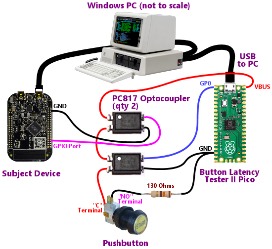

# Button Latency Tester II

This is a Pinscape Pico sub-project that turns a Raspberry Pi Pico into
a piece of test equipment for measuring button input latency on **another**
device.  The other device, which we'll refer to as the "subject" device
because it's the subject of the measurements, can be **any type of device**,
Pico or otherwise, that takes physical button inputs and turns them into
some kind of input to a Windows PC.  The subject device could be:

* Another Pico running the Pico Pinscape firmware

* Another Pico running some <i>non-</i>Pinscape firmware, such as Dude's Cab Controller or RickH's Little Bang controller

* A KL25Z running the original Pinscape firmware

* A proprietary key encoder, such as an Ultimarc I-PAC or a Zero Delay encoder

* A USB or PS/2-port keyboard

* A serial-port joystick

The last two (a physical keyboard or joystick) are less practical than
the others, because the testing setup requires physical access to the
switch wiring in the subject device, thus you'd have to do some
invasive surgery if you wanted to test a real keyboard or joystick.
It's much easier to work with button encoder devices that are designed
from the ground up to be connected to external button switches.  But I
wanted to make the point that you *could*, at least in principle, use
BLT-II to measure just about anything with buttons that sends input to
a PC.

This project is nominally part of Pinscape Pico, but you can also use
it as a standalone measurement tool for other types of devices.  You
don't need to install the main Pinscape firmware onto any devices to
use it.  You only need to install the much simpler Button Latency
Tester II firmware, which doesn't require any configuration.

## API selection

The Windows host program can read input through four different Windows
APIs:

* Raw Input

* DirectInput 8

* XInput (Microsoft's special API for XBox controller devices)

* [Open Pinball Device](http://mjrnet.org/pinscape/OpenPinballDevice/OpenPinballDeviceHID.htm)

When you map a physical button on the subject device to XInput or Open
Pinball Device buttons, the host program automatically uses those
respective APIs, because they go hand-in-hand with the sources.

For keyboard and gamepad button inputs, you get your pick of Raw Input or
DirectInput.  Raw Input is the default, because it's much faster than
DirectInput, and also because it's the "modern" API that Microsoft
recommends.  Microsoft deprecated DirectInput many years ago (way back in
the Windows 7 timeframe), because Microsoft likes to invent new APIs every
few years that do exactly the same thing as the old APIs they replace.  But
in this case, they had the right idea, because DirectInput is objectively
horrible, as you will see when you run tests with this program.  DirectInput's
median latency for joystick and keyboard events is about 5x greater than Raw
Input's when reading exactly the same devices, and at its worst, DirectInput
reaches the human-perceptible latency range of around 30ms.

To select DirectInput, add `--api directinput` to the command line when
running the host program.

### Initial findings about the APIs

My own ad hoc testing indicates that applications should use Raw Input
and Open Pinball Device whenever possible.  With Pinscape Pico devices
(which are designed to yield the minimum possible HID-level latency),
Raw Input and Open Pinball Device provide a median latency around 2ms,
with excellent consistency (standard deviation in the 0.3ms range, and
maximum latencies around 3ms).  That means that RawInput is adding
practically no overhead, as Microsoft claims.

DirectInput 8 is by far the worst API, with median latency around 9ms,
and extremely wide variation, up to 30ms latency for some inputs.
Much to my surprise, XInput is almost as bad as DirectInput, with
median latency around 8ms and maximum latency around 25ms.  I would
have expected XInput to use the same low-level approach as Raw Input,
given that XInput is all about gaming, but empirically this doesn't
seem to be the case.

All of my testing was on Windows 11, so it's quite possible that the
numbers will vary somewhat on other versions, although I expect that
the hierarchy will be the same everywhere.  Note that my API
comparisons are very apples-to-apples, since they used the same
physical source for all of the input types, just with different
logical mappings for the buttons.

## Firmware installation

Install the Button Latency Tester II firmware using the standard Pico
boot loader procedure:

* Unplug the Pico from USB and all power sources

* Press **and hold** the BOOTSEL button (the small white button on top of
the Pico, labeled BOOTSEL)

* While still holding BOOTSEL, plug in the USB cable

* Release the BOOTSEL button

* The Pico should now appear on the Windows desktop as a virtual
USB thumb drive

* Copy ButtonLatencyTester2.uf2 onto the virtual thumb drive
representing the Pico

* The Pico will automatically reboot and start running the firmware

* From a Windows command prompt, run `ButtonLatencyTester2 --list` to
verify that the device appears in the list of recognized devices

* No configuration is required on the device side, and no device
drivers are required on the Windows side

## Recommended Test Bench Setup - description

One key to accurately measuring the latency is to capture the exact
moment when you press the button.  The whole point of the exercise is
to measure the time between the button press and the arrival of the
corresponding input event on the PC, so we need to know the time of
each of those endpoints.

To precisely measure the time of the button press, we set up the
button so that it's physically connected to **both** the subject
device and the BLT-II Pico.  This ensures that the BLT-II Pico sees
the physical button press at exactly the same time as the subject
device, giving us an accurate reading on the beginning endpoint of the
time interval we're trying to measure.

The best way to connect a single button to both devices without any
risk of electrical interference between the two devices is to use an
optocoupler to isolate the button from each device.  In the
recommended setup, the button is wired to **two** optocouplers - one
for the subject device, one for the BLT-II Pico.  When you press the
button, it activates both optocouplers simultaneously.  This sends the
button press signal to the subject device and the BLT-II Pico at the
same moment.  The subject device uses the input to initiate its input
event to the host, and the BLT-II Pico uses the signal to record the
time of the physical button press.

An optocoupler's transistor (Collector/Emitter) side acts roughly like
an ordinary switch, so for the Pico and for most subject devices, it
can take the place of an ordinary pushbutton switch in a button input
port's wiring.  This works as long as the subject device's button
input ports are voltage-sensitive and high-impedance (very low current).
This is true of the Pico, and for most other microcontrollers.

## Recommended Test Bench Setup - how to

You'll need the following parts:

* A Raspberry Pi Pico, with the Button Latency Tester II firmware installed
(see above)

* The Subject Device (the device whose button latency you wish to measure),
with its firmware installed and configured for the scenario you wish to test

* A Windows PC, with the ButtonLatencyTester2.exe host program installed

* Two (2) PC817 optocouplers, or any equivalent optocouplers

* One 130 Ohm resistor

* One pushbutton

<b>IMPORTANT:</b> The diagram below assumes that the subject device uses **active-low**
button inputs.  This means that the subject device registers the button as ON when the
button terminal is connected to GND (ground), and registers the button as OFF when
the terminal is left floating (not connected to anything external).  For an active-low
controller, the **normal** wiring plan you'd use, in the absence of the test setup, is
as follows:

* Connect one terminal of the button to a button port on the subject device

* Connect the other terminal of the button to GND (ground)

If the subject device **doesn't** follow this wiring plan, you'll have to adjust
the test setup accordingly.  In *most* cases, the PC817 optocoupler in the test setup
simply takes the place of the button switch in the subject device's normal wiring
plan, but this isn't always possible.  This works as long as the device's button
input ports are voltage-sensitive and high-impedance (low current), which is true
for most microcontrollers.  If your subject device doesn't use active-low wiring, or
you're not sure that an optocoupler is a valid substitution for a physical switch for
its button wiring, check with the device's manufacturer or designer.  (Please also
let me know about it, so that I can list the specific cases people have come across
that don't fit the basic "active low" pattern.)

<b>REGARDLESS</b> of the subject device's wiring configuration, the BLT-II Pico portion
is **always** connected as shown in the diagram.  That's another reason to use the
optocoupler isolation setup: it makes the Pico wiring a constant, no matter how
the subject device is wired.

Wire the devices as shown in the diagram:

* Connect the first optocoupler pin 1 (LED +) to the Pico's VBUS port

* Connect the first optocoupler's pin2 (LED -) to the second optocoupler's pin1 (LED +)

* Connect the second optocoupler's pin2 (LED -) to the common ("C") terminal of the pushbutton switch

* Connect the Normally Open ("NO") terminal of the pushbutton to the 130 Ohm resistor

* Connect the other end of the resistor to any available GND (Ground) port on the Pico

* Connect the first optocoupler's pins 3 and 4 (Collector and Emitter) to the
button input GPIO port and GND terminals, respectively, on the Subject Device

* Connect the second optocoupler's pins 3 and 4 to GP0 and GND on the BLT-II Pico

You can test multiple buttons by wiring them just like the first
button, choosing a new GPIO port on the BLT-II Pico for each
additional button.  You'll need another full set of components (two
optocouplers and a resistor) for each additional button.  All 26 of
the Pico's GPIO ports are available as button inputs.  Note that you
can connect any GPIO set of ports you wish - there's no need to start
at GP0.  Our choice of GP0 as the first port in the diagram is
arbitrary.

## Run the program

Once your test bench is set up as shown, run the ButtonLatencyTester2.exe program
on the Windows PC host.  On the command line, you must specify the button
configuration, mapping the following elements:

* Windows event input button name

* BLT-II Pico GPIO port number

* BLT-II Pico device ID (only required if you have more than one BLT-II Pico connected)

The full structure of the button mapping looks like this:

<tt><i>button-name</i><b>:</b><i>gpio-number</i></tt>

For example, if the button is mapped on the subject device to generate
virtual "Escape" key presses on the keyboard, and the Pico connection
is to GP0, you'd enter a command line like this:

`esc:0`

If the button on the subject is mapped to joystick button #3, and it's
connected to GPIO 12 on the BLT-II Pico:

`js3:12`

For a full list of accepted button names, run the program with the `--buttons` option.

### Raw Input vs DirectInput

The Windows host program gives you the option to measure keyboard
and joystick/gamepad input through two APIs: Raw Input and DirectInput.
This is purely a choice on the Windows side, and has nothing at all to
do with the subject device, which only thinks in terms of keyboard
or joystick/gamepad input at the USB level.  If the device provides
keyboard input, you can use RawInput or DirectInput interchangeably.

Raw Input is always selected by default.  To use DirectInput instead,
specify `--api directinput` on the command line.

The reason that the host program offers both options is that *applications*
can use either API.  Choosing the same API that your target application
uses will most accurately re-create the conditions in effect during
real sessions with the application, for accurate measurement of the
latency that you'll see in practice using that application.

The choice of APIs is also meant to be useful to application
developers to compare the latency impact of different API choices.

## End-to-end latency measurement

Other people have devised ways to measure latency in gaming devices,
so this isn't exactly a new science.  But Button Latency Tester II
brings something to the table that I think is unique among testing
methods: **end-to-end** testing.  That means that the tool measures
the latency across the complete input path, from the moment of the
physical switch contact that signifies the button press, to the moment
where the application receives the corresponding Windows input event.

Most other latency measuring methods read USB input directly from the
subject device.  That's good for comparing *relative* latencies
between devices, but it doesn't tell you the true latency, taking into
account the transit through the Windows software layers.  This is
important because Windows has a very complex input processing model
with many redundant APIs.  The overall latency is not only a function
of the latency as far as the physical input port to the PC, but also
of the class of input event (keyboard, joystick, XInput, Open Pinball
Device) *and* the specific API that the application uses to read its
input.  BLT-II lets you see the full picture, measuring the full time
from physical button press to final application input ingestion point.
This lets you optimize not just the choice of device, but also which
type of input it's sending and which APIs the application uses to
process the input.

Another capability that I think is unique is that BLT-II can be used
to measure latency with <b>non</b>-USB devices, such as devices that
connect to an RS-232 serial port input or a PS/2 keyboard.  The BLT-II
Pico doesn't have to connect directly to the subject device, so it
doesn't matter how the subject device connects to the PC.  Everything
is mediated through the host PC.  As long as an **application** can
receive input from the subject device, we're in business; it doesn't
matter what physical path through which physical ports the input took
along the way.

## Instrumenting an application

One more interesting thing you can do with BLT-II is use it to
instrument an application, to see what latencies look like in that
specific application.

BLT-II comes with its own Windows host application that's designed to
measure the input latency all the way through the Windows input API
layers.  That's an excellent basis for comparing latencies among
devices *and* among different Windows APIs, but it doesn't tell you
how any given application will experience latency.  Applications add
their own input processing layers that can add latency beyond the
point of event ingestion from the Windows APIs.

For example, if an application uses a polling model to read input, and
it only polls for input once per video refresh cycle, its mean latency
will be at least half of the video refresh cycle time, which is about
8 ms for a 60 Hz display, and its worst-case latency will be at least
one full refresh cycle, 16 ms.  In can be difficult to understand
these effects purely from analysis of an application's architecture or
inspection of its source code, because any "real" application is a
complex system, and it can exhibit behaviors that arise from
interactions among its parts that aren't obvious on inspection.  The
best way to truly understand these effects is to measure them.

BLT-II includes a C++ "library" module that's relatively easy to embed
in a C++ application.  (It could also be worked into a .Net application,
but that would take a little more work, since the interfaces for
importing native code aren't the friendliest part of .Net.  It might
be easier to "port" the library module to C#, which would let you
use it directly in any .Net language.)

The only bit of "design" work that you'll have to do to add BLT-II
instrumentation to an existing program is to decide how you're going
to map input events to BLT-II GPIO ports.  The BLT-II host program is
a bad example, because it's trying to achieve maximum generality, by
allowing the user to map essentially any type of HID input, through
multiple APIs.  That's why it has that horrendous command-line syntax
where you have to specify the API, button name, and GPIO port for
every input you want to monitor.  You *could* add the same sort of
thing in an existing program, but I don't recommend it.  Instead, I'd
recommend using a simple "fixed" mapping, where you **pre-define** the
inputs you want to monitor and how they're assigned to BLT-II Pico
GPIO ports.  You then leave it up to the user to wire the BLT-II Pico
to the ports as you specify.  This means that the user doesn't have to
provide any new configuration input to your program, and your program
doesn't have to parse any new input.

For a pinball program, for example, you could decide that you only
care about testing latency for the flipper button inputs, and that
these must be wired on the BLT-II to ports GP0 and GP1, respectively,
for the left and right flipper buttons.  You instruct the user to wire
things so that the flipper buttons are connected to the BLT-II Pico on
GP0 and GP1.  There's nothing extra the user has to specify when
running your program, and no extra code in your program to parse new
configuration files or command line options.

Once you've decided on an input mapping strategy, the rest is pretty
straightforward.  The BLT-II add-in module is self-contained, and
you only have to add a few function calls to your program to make
it work.  Here's the procedure:

* Add the files `BLTVendorInterface.h` and `BLTVendorInterface.cpp` to your project

* In your program's startup code, call `ButtonLatencyTester2::VendorInterface::EnumerateDevices()`
to get a list of "descriptors" that represent the connected BLT-II Picos.  If you want to keep
things simple, you can assume that only BLT-II Pico is ever attached at once, and fail with an error if
the list is empty or has more than one entry.

* Open live connections to the BLT-II device or devices, by calling `Open()` on the descriptors
returned from `EnumerateDevices()`.  This hands you back a "device interface" object that represents
a live USB connection to the Pico.  This is what you use to communicate with the Pico later on
to notify it when you receive input events that it's monitoring.

* At the point in your application where you read input events from the Windows API, mark the
microsecond-clock time of each event by calling `ButtonLatencyTester2::VendorInterface::GetMicrosecondTime()`.
You should record this time for each event as soon as possible after calling the input API, since
this defines the "receive" end of the latency calculation.  If your application has its own
input processing layers that must be traversed before the application will be able to interpret
and respond to the event, you should take the time reading **after** traversing those layers,
since what you're really trying to measure here is how quickly the application can **react**
to an event.  For example, if you have a low-level routine that reads input from a Windows
API, but it then places the event in an internal queue that will be processed on another
thread, you should take the time measurement when the other thread receives the event.
The time that the event spends sitting in the queue contributes to the user's perception
of the latency, so it should be included in the time calculation.

* Once you have the timestamp, inspect the input event to see if it corresponds to one
of the events you're monitoring with the BLT-II.  If it does, call `HostInputEvent()` on
the device interface object you got back from the device descriptor `Open()` call earlier.
This call closes the loop on the event.

After a session, you can use a terminal program (e.g., PuTTY) to
connect to the Pico's virtual USB COM port to view the statistics
gathered during the session.  It's also possible to retrieve the
statistics within your program, but you probably won't want to bother
with that, since whatever program you're instrumenting probably
doesn't have a natural place in its user interface to display a screen
full of statistics.  It's probably not worth adding one, either, when
you can just use the built-in analysis tools in the BLT-II firmware.

## Theory of operation

The BLT-II test setup has three devices:

* A subject device, such as a Pinscape KL25Z

* A Pico running the Button Latency Tester II firmware

* A Windows PC

Note that we're using a KL25Z in this example, rather than a second
Pico, to help keep straight which device is which.  If they were both
Picos, we'd have to more verbose about specifying which Pico we're
talking about at any given time, and it would probably still be too
easy to confuse them.

The point of the test setup is to measure the latency of a button
inputs, which is defined as the elapsed time between physically
pressing the button (or more specifically, the moment when the
button's internal switch makes electrical contact) and the arrival of
the corresponding high-level Windows input event at the application
layer.  The application layer is typically a Windows input loop, such
as a window procedure or message loop.  This represents the first
possible moment where the application can respond to the input event.
Any further processing time *in the application code* doesn't count as
latency for our purposes, because anything beyond that point is part
of the application, not part of the input mechanism.

To measure this latency, the BLT-II Pico needs two data points for
each event:

* The time on some reference clock of the physical button press

* The time on the same reference clock when the application receives the event

The first time measurement - the physical button press - is obtained
by physically wiring the button to a GPIO port on the BLT-II
Pico, **in parallel with** the wiring to the subject device (the KL25Z
in our example setup).  The BLT-II Pico monitors its GPIO ports in a tight loop,
allowing it to recognize a button press within a few microseconds.  A good
microswitch exhibits about 2ms of "bounce" when the switch transitions
from open to closed, with individual oscillations on the order of 10us.
Recognizing an edge within a few microseconds thus allows for
essentially instantaneous recognition of each button-press event.
This gives us a very precise starting point for the latency measurement.

The second time measurement - the arrival of the input event in the
Windows application - isn't something the BLT-II Pico can directly
measure, since that occurs on the Windows PC.  And likewise, the
Windows PC doesn't know when the button was pressed - it just knows
when it got the input event.  So at this point, the PC has to talk
to the Pico to tie its Windows input event back to the button-press
hardware event that the Pico observed.

This seems straightforward enough: the PC sends the event time back
to the Pico by USB, and the Pico figures the latency as the difference
of the two timestamps.  Easy, right?  Not so fast: the two timestamps
are on *independent clocks*.  The button-press timestamp was recorded
on the Pico clock, and the Windows event time was recorded on the PC clock.
The two clocks are independent, with their own "zero" points and their
own frequency generators.  The button-press timestamp on the Pico is
represented as "X microseconds since the Pico was booted", and the
Windows event timestamp is similarly "Y microseconds since Windows
started". If we compute "event time minus button time", the result
will be "Y - X - Windows reboot time + Pico reboot time".  In other
words, it's effectively meaningless, since we have no idea how
the respective Windows and Pico reboot times are related - that part
of the equation adds an unpredictable (and probably large) number
to the total that we have no idea how to eliminate.

There *is* a way to get the two timestamps on an even footing, so that
we can compute a meaningful elapsed time.  The way to do that is to
reformulate the timestamps so that they're both relative to some
agreed-on **common reference point in real time** that both machines
can precisely measure on their internal clocks.  This might seem
easily solved: just have the devices exchange clock times by USB.
Yes, that would work, but it would add a lot of uncertainty to the
time calculation, because the USB connection operates on a 125us
"microframe" cycle.  If the Pico sends a message to the PC, it will go
out on the next microframe cycle, which could be right now, or it
could be 125us from now.  That degree of uncertainty isn't great when
we're trying to measure latencies that are on the other of a
millisecond.

Fortunately, USB does give us a way to synchronize the two clocks to a
much higher degree of precision - down to almost the microsecond
level.  The key is the SOF (Start of Frame) packet.  Every 1ms exactly
(plus or minus 500 *nanoseconds*, if the hardware adapter complies
with the USB specifications for Full Speed devices), the USB hardware
on the PC sends an SOF packet to the device.  This happens in the USB
adapter hardware, so it's not affected by how busy Windows is.  The
hardware clock relentlessly ticks along no matter how loaded the CPU
is or how saturated the PCI bus is, and the SOF goes out on that
precise 1ms cycle.  What's more, at this nuts-and-bolts level, there's
nothing like "buffering" that could add more time uncertainty.  The
SOF packet is literally a series of voltage signals on the wire, and
the Pico physically receives those voltage signals at exactly the same
time that the PC USB adapter generates them.  There's nothing in
between except for a short run of wire, so we're talking
speed-of-light timing, in the nanosecond range.  So there's virtually
no time uncertainty.  On the Pico, the reception of an SOF packet
triggers a hardware interrupt from the USB adapter, so the CPU is
looped in on the SOF event within a few hundred nanoseconds.  The
BLT-II firmware intercepts this interrupt, and records the time of the
SOF on the Pico's microsecond clock.  The result is accurate to about
+/- 2 microseconds after taking into consideration the CPU's response
time dispatching a hardware interrupt.  On the PC side, the USB
hardware provides similar timing information, with a similar degree of
accuracy, to the Windows USB device drivers.  The WinUsb driver that
the BLT-II host software uses to communicate with the Pico provides
application-level access to the SOF timing information.  So we have
our common reference point: the PC and the Pico can both agree on
exactly when the last SOF signal occurred.  What's more, the SOF
packets are numbered, so the two sides can be sure they're agreeing on
the *same* SOF signal when they figure the shared reference point.

The PC and the Pico can both measure the SOF time to about +/- 2 us,
so the overall uncertainty in their agreement on time is about +/- 5 us.
HID latencies are inherently on a millisecond time scale, so this
gives us better than 0.5% accuracy in our latency measurements.

Note that this approach - synchronizing the Windows and Pico clocks
based on a common shared reference point in time - means that the
timing results aren't skewed by the necessity of the extra USB message
back to the Pico to close the loop on the event.  The Windows host
program marks the time it receives the event, so the latency stopwatch
freezes at that point.  Nothing past that point counts in the latency
calculation.  The key to making this work is that the Pico can properly
interpret the Windows-side timestamp, based on the USB SOF shared
reference point.

There's one more detail here that's worth mentioning, for those
interested in implementing this sort of Pico-to-Windows time
synchronization.  The Pico clock will drift out of sync with the
Windows clock quickly after a synchronization point, so it's important
to use an SOF marker that's very close in time to the event you're
measuring, preferably within a few milliseconds.  The Pico clock's
claimed accuracy is 30 ppm (parts per million), which sounds pretty
good, but amounts to 2.5 seconds of drift over the course of a day,
and about 100us of drift over just three seconds.  That's not much on
a human time scale, but it's a significant error term if you're trying
to measure elapsed times in the milliseconds.  A time snapshot made
within the course of typical HID input time of a few milliseconds
will be accurate to about 0.1 microseconds, which is much smaller than
the uncertainty in the SOF time measurement itself, making it a
negligible contribution to the error term.
