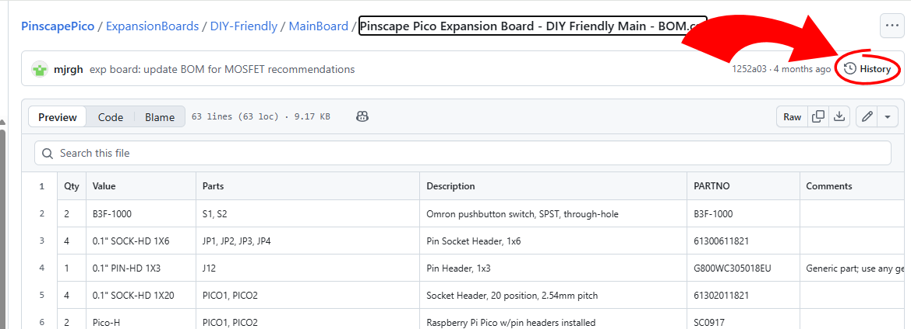
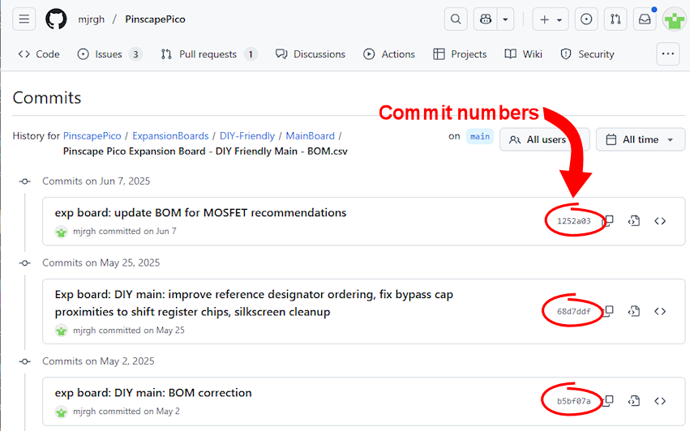
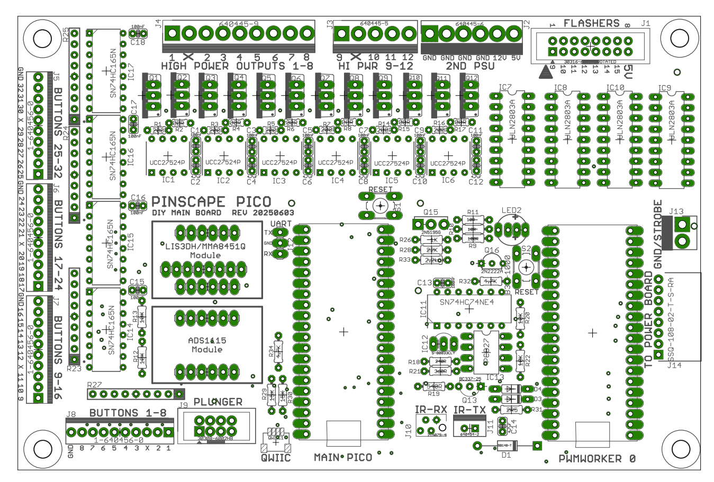
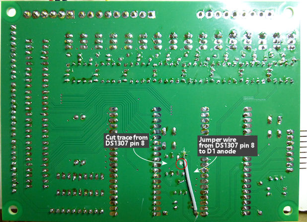
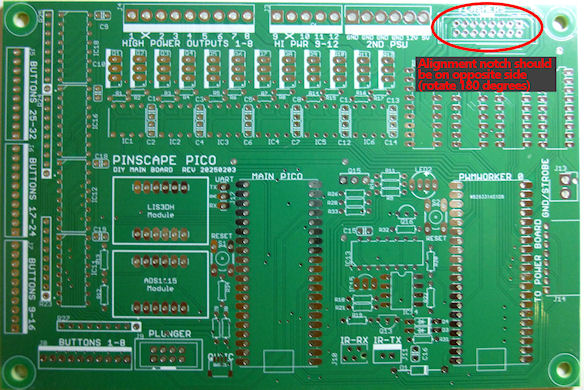

# Pinscape Pico - DIY-Friendly Expansion Board

This is an EAGLE design for a two-board expansion set for the Pinscape
Pico software.  Pinscape Pico is firmware for the Raspberry Pi Pico
that turns a Pico into a highly customizable I/O controller for
virtual pinball cabinets.

## Description

This board set is my second Pinscape Pico expansion board design.  The
first is an All-In-One board that packs everything you need for a
well-equipped pin cab onto one 10x16 cm board.  To achieve that kind
of density, that design uses tiny SMD (surface-mount) parts for just
about everything, some of which are too small even to handle with
tweezers.  It's not something you want to assemble by hand, unless
your other hobby is building Swiss watches from scratch; it's really
only feasible to build in a factory with a pick-and-place machine.
That's only cost-effective if you're going to order at least 50 or 100
units, so I expect that the all-SMD board will only be of interest to
our more entrepreneurially-minded community membe who might be
willing to order up a batch and offer them for retail sale.  That's
why I've taken to referring to that design as the "Pro" expansion
board.

But Pinscape has always been for DIYers.  My mission from the start
has been to make it possible to build high-end pin cabs without
depending on commercial devices, since we're such a niche hobby that
it's hard to get most commercial vendors to take us seriously as
customers.  So I didn't like the idea of only having a "Pro" design; I
also wanted to provide a DIY-friendly design that works with the new
software.  That meant designing another board using only parts that
are easy to solder by hand.

The result is this two-board expansion set.  It outfits the Pico with
a large set of physical input and output connections that let you
connect just about everything you'd find in a top-of-the-line pin cab,
from button inputs to feedback device outputs.  It has two main
design goals:

* It's comprehensive: it provides the extra peripherals required for
all of the Pinscape features (accelerometer, plunger input, button
input, feedback device control, IR remotes, TV ON power sensing), and
has ample button and feedback device ports to wire a fully decked out
pin cab

* It's DIY-friendly: it includes only through-hole parts that can
be easily soldered by hand

A third, lesser-but-still-important priority is to use common parts
that are widely available and are likely to remain in production for
many years.  The original Pinscape KL25Z boards are difficult to build
today because they depend on a few specific parts that are no longer
in production, most especially the KL25Z itself, but also the
TLC5940NT PWM chips.  I tried to avoid those sorts of dependencies as
much as possible in this design.  The biggest unique-part dependency
is the Pico itself, which is widely available and well supported by
Raspberry Pi.

Unlike the original Pinscape KL25Z expansion boards, where you were
encouraged to mix and match the Main, Power, and Chime boards in
different combinations to come up with a bespoke port layout, this
board set is designed as a One-Size-Fits-All solution.  There's no
provision to add a second or third power board, and there aren't any
optional add-on boards comparable to the Chime board.  The goal is
that the two boards have enough general-purpose ports between them
that no one would even want to add a third board - the two boards
should cover just about everything in a full-featured pin cab.

You can, however, use the main board all by itself.  I tried to
arrange things so that almost everything is on the main board, except
for the bulk of the output ports.  And even then, the main board has a
fair number of outputs.  If you use the main board on its own, you
still get the 16 flasher/strobe ports and 12 of the high-current MOSFET
outputs, plus all of the other I/O functions (buttons, accelerometer,
plunger connections, IR remote, TV ON).  The second board just adds 16
more high-current MOSFET outputs and the 32 mid-power lamp outputs,
plus the real-time clock chip, which most people won't especially miss.
If you don't need all of the extra output ports or the RTC, the main
board makes a perfectly good stand-alone controller.

My reason for using a less "modular" design than the old boards is
that I think the modularity ended up being a net negative: it added
flexibility, but at the cost of more complexity.  And I don't think
very many people took advantage of the flexibility - I think
practically everyone built one of the "standard" configurations,
either the Main + Power board combo, or a Main + Power + Chime set.
But everyone still had to go through the process of planning their
setup and then customizing their configuration settings once it was
built.  This time around, I figured that if everyone's going to build
the standard configuration anyway, let's make the standard configuration
so comprehensive that no one would really need other options.  It
simplifies the design, and it simplifies everyone's planning and
setup process.

## Features

* 32 button inputs, using shift register chips for extremely low latency
scans (order of 10 microseconds)

* Accelerometer (LIS3DH), installed via a pre-assembled module
available from Adafruit (no need to hand-solder the tiny SMD chip),
for nudge sensing

* An optional ADC (analog-to-digital converter, ADS1115), installed
via a pre-assembled module available from Adafruit, for high-precision
analog input from a potentiometer-based plunger (improving on the Pico's
mediocre built-in ADC)

* 28 MOSFET outputs for high-current feedback devices, such as motors,
solenoids, and standard LED strips

* 16 flasher/strobe ports for high-current LEDs, up to 1A per port,
for driving the 3W RGB LEDs typically used for flasher panels plus
a strobe LED

* 32 medium-current ports, up to 500mA per port, for driving almost
any sort of lamp (small incandescent or LED bulbs like those used in
lighted pushbuttons, small LEDs, large LEDs), relays and contactors,
and anything else that runs on less than 500mA

* All output ports have full PWM control, with configurable PWM
frequencies up to 65000 Hz

* Plunger input port, pin-compatible with the original Pinscape KL25Z
plunger port; just plug in your existing Pinscape plunger

* IR transmitter and receiver, with the sensor and transmitter on
small separate boards (connected to the main board with cables), so
that can be positioned anywhere in (or outside) the cabinet, to place
them in line-of-sight with the devices they're communicating with

* Power-sensing circuit for the Pinscape TV ON function (to help you
implement seamless one-button startup of the whole pin cab, even when
using TVs that don't remember their power state)

* Real-time clock/calendar chip with battery backup, for time-keeping
across Pico resets, even when the board is unpowered

## Board Design Files

Each board set consists of two sub-boards, titled **Main** and **Power**.
These two boards are designed to work together as a set.

Each sub-board design is contained in a pair of EAGLE files: **.sch** is the schematic,
and **.brd** is the physical board layout file.

The **.sch** file is a schematic, which is a special symbolic language
that electrical engineers use to describe the connections between
components in a circuit.  The symbology is more or less standardized,
so anyone with a basic knowledge of electronics should be able to read
it.  The schematic doesn't have any details on how the parts are laid
out physically, so it can't be used by itself to manufacture a board.
It's primarily for use by humans, to understand how the board works at
the electronic level.

The **.brd** file represents the complete physical layout of the
board.  This implements the same abstract network of connections
contained in the schematic, but it adds full details on the exact
physical placement of each component, and the layout of the copper
traces between components.  The **.brd** file contains everything that
a manufacturer needs to make a physical copy of the board.

### Viewing an EAGLE file

The **.brd** and **.sch** files are EAGLE documents.  EAGLE is a
circuit designer program published by Autodesk, with a free
personal-use version available at https://www.autodesk.com/products/eagle/free-download.
The free version has restrictions on how large a board you can edit,
but it does let you **view** boards of any size, and it also lets
you run the CAM Job Processor, which is how you create Gerber files
for submission to fabricators (see below).

There are also a number of on-line EAGLE file viewers - try searching
for **on-line EAGLE file viewer**.  One of those might be more convenient
if you only want to view the files, since there's nothing to install.

### Gerber Files (what you send to the board fabricator)

Most board fabricators require you to supply them with a special file
format called **Gerber files**.  The exact format for the Gerber files
varies slightly by fabricator, so there's no practical way that we
can include pre-built Gerbers for every vendor out there.  Instead,
we provide the **.brd** files, and leave it up to you to generate
the Gerber files for your chosen fabricator.

Fortunately, the process to convert a **.brd** file to Gerber files is
essentially automatic in EAGLE.  All you need is the Pinscape **.brd** file,
and a separate that your fabricator providers, called the **.cam**
file.  The **.cam** file contains programmed instructions for the
vendor-specific Gerber rules.  EAGLE has a simple procedure you can
follow that combines the **.brd** and **.cam** files to produce the
Gerber files for your specific vendor:

* Go to your chosen PCB fabricator's Web site and find their submission instructions.
Look for the EAGLE section.  That should provide links to the vendor's **.cam** file
for EAGLE.

* Load the Pinscape .BRD file into EAGLE (https://www.autodesk.com/products/eagle/free-download)

* In the EAGLE board viewer window, select **File** &gt; **CAM Processor**

* In the CAM Processor window, select **File** &gt; **Open** &gt; **Job**

* In the file dialog, select the **.cam** file that you downloaded from your PCB vendor

* Click **Process Job**

* You should now find a collection of new files in the folder containing the
BRD file.  These typically use the following extensions (although the exact
ones might vary by vendor): .GBL .GBO .GBP .GBS .GKO .GTL .GTO .GTP .GTS .XLN.
These are the Gerber files.

* You'll have to check your vendor's instructions for the next step,
but in most cases, you simply create a ZIP file containing all of the
Gerber files created above, and upload the ZIP file to the vendor, and
they'll take it from there.

## Parts Lists - "Bill of Materials" (BOM)

In addition to the EAGLE design files (SCH and BRD), each board has a
matching BOM (Bill of Materials) file.  The BOM is provided in CSV
(Comma-Separated Values) format.  BOMs are essentially shopping lists
for the electronic components you need to populate the board.  You can
view CSV files in spreadsheet programs like Microsoft Excel, Apple
Numbers, or Google Sheets.  Mouser and Digikey accept CSV files as
direct uploads to construct shopping carts, so that you don't have to
re-type all of the part numbers.

## BOM Versions

<b>Important:</b> Always match the <b>version of the BOM</b> to the
</b>version of the circuit board</b> you're building.  The specific
components used, and their reference designator assignments ("R3",
"IC7", etc), can change across versions.

github keeps a full history of every file (that's really the whole
point of git), but you have to deliberately go look for an old version
if you need one, because github's default view simply shows you the
latest version of everything.

To see the full version history of a file, find the BOM file in
the github tree, open it, and then click the <b>History</b> button
at the top right of the page.

Go down the list and find the version with the date that's closest to
the revision date printed on your physical circuit board.  You should
find the date printed on the top of the board, in the format "REV
20250603".  That's the revision date, formatted as a year, month, and
day - "20250603" means 2025 June 03.  In most cases, the file history
version that's <b>after</b> that date and closest to it will be the
one to use.

For convenience, here are links to BOM versions for a few board
revisions that I know people have manufactured so far.  This isn't
comprehensive, though, so if you have a board version not listed, just
use the procedure above to find the right version.

<ul>
    <li>Rev 20250203
    <ul>
        <li>Commit 6d375de
        <li>Main: https://github.com/mjrgh/PinscapePico/blob/6d375de3afc79e1a0121002b1ce2c9939880554a/ExpansionBoards/DIY-Friendly/MainBoard/Pinscape%20Pico%20Expansion%20Board%20-%20DIY%20Friendly%20Main%20-%20BOM.csv
        <li>Power: https://github.com/mjrgh/PinscapePico/blob/6d375de3afc79e1a0121002b1ce2c9939880554a/ExpansionBoards/DIY-Friendly/PowerBoard/Pinscape%20Pico%20Expansion%20Board%20-%20DIY%20Friendly%20Power%20-%20BOM.csv
    </ul>
    <li>Rev 20250603
    <ul>
        <li>Commit 1252a03
        <li>Main: https://github.com/mjrgh/PinscapePico/blob/1252a03060d82a5c3b8f7cad5739bbce4cbe7fbf/ExpansionBoards/DIY-Friendly/MainBoard/Pinscape%20Pico%20Expansion%20Board%20-%20DIY%20Friendly%20Main%20-%20BOM.csv
        <li>Power: https://github.com/mjrgh/PinscapePico/blob/1252a03060d82a5c3b8f7cad5739bbce4cbe7fbf/ExpansionBoards/DIY-Friendly/PowerBoard/Pinscape%20Pico%20Expansion%20Board%20-%20DIY%20Friendly%20Power%20-%20BOM.csv
    </ul>
</ul>

If you're ever unsure about a version match, you can verify it by
checking the version of the **.brd** file that's stored under the same
github commit number (the six-digit hexadecimal code listed alongside
each version in the history view).  Each commit represents a **complete snapshot of the entire repository,**
so you can be sure
that all of the files at a given commit number are in sync with each
other.  Once you find the BOM version you think is right, you can look
at the **.brd** file history, find the same commit number in the list,
and then check the REV number on that version by opening the **.brd**
file in an EAGLE viewer.

## Important Notes on the BOM

<b>Gate driver resistors (R1, R2, etc):</b> The BOM specifies three
options for these resistors.  The recommended value is 200 Ohm.  Line
items for 4.7 Ohms and 47 Ohms are also included for reference, with
zero quantity.  The tradeoff in choosing a resistor value is that
lower values yield faster MOSFET switching transitions during PWM
operation, reducing MOSFET heating, but higher values are more
protective of the UCC27524P gate driver chip.  According to the
UCC27524 data sheet, the chip should be compatible with very low gate
resistor values, as low as zero Ohms, but early testing suggested that
there's a risk of overloading the chip when a MOSFET with high gate
capacitance is combined with a small gate resistor.  The recommended
200 Ohms appears to be a good middle ground that yields cool MOSFET
operation without risk of UCC27524 damage, even for high-capacitance
MOSFETs.

<b>IR emitter:</b> Two different part numbers are listed for the IR
emitter: VSLB4940 and TSAL6400.  You only need one or the other, and
they're interchangeable as far as the expansion boards are concerned.
You can use either one without making any changes to the boards.
Both will work equally well, but VSLB4940 is a newer device with
slightly higher luminosity specs, so it will probably work over
slightly longer distances than TSAL6400.  TSAL6400 is a tried-and-true
device that I recommended for the original Pinscape KL25Z expansion
boards, so it will work well too.  Choose based on price and
availability, but other things being equal, I'd go with the slightly
brighter VSLB4940.  In my testing, I got at least 10 feet of range
with that emitter.

<b>MTA-156 and MTA-100 connectors:</b> The BOM includes the pin header
<b>and</b> matching IDC wire housing for each connector.  The wire
housings are IDC type, which is fast and easy to wire - but note that
it requires a <b>specific wire gauge</b> for each housing.  I chose a
mix of 24 AWG and 22 AWG connectors - 24 AWG for low-power wiring like
buttons and lamps, and 22 AWG for the high-power MOSFET outputs.  The
MTA-156 and MTA-100 product lines also include mating connectors for a
range of other wire gauges, so if 22 and 24 AWG aren't right for your
needs, you can substitute the corresponding MTA connectors for your
desired gauge.  The **headers** are independent of wire gauge, so you
don't need to change those - it's the **IDC housings** that go with a
specific gauge.  I chose 22 and 24 because they're perfectly adequate
for the respective jobs, and it's easy to source wire in those sizes.
From a cost perspective, it's better to minimize the number of
different wire types you use so you can buy big spools of a few types,
rather than lots of little spools.

### IR Remote

This board has support for an optional IR remote control transmitter
and receiver.  You can connect either or both as desired.  The IR
transmitter lets you send commands to your TVs and any other devices
that can receive IR signals, which you can use to send them commands
to power on, select inputs or video modes, etc.  The IR receiver lets
Pinscape receive IR remote control codes from just about any IR remote
control you have handy.  You can use IR remote inputs as though they
were physical buttons on the cabinet, to send commands to the PC host.

Both the transmitter and receiver are designed to be separated from
the main board, so that you can place them in convenient locations
where transmitters and receivers can "see" each other properly.  This
lets the signals get in and out even if the main board is buried deep
inside your pinball cabinet.  The off-board devices connect to
the main board through cables, which connect to headers on the main
board (the headers labeled IR-TX, for the transmitter, and IR-RX, for
the receiver).

<b>Transmitter:</b>  The IR transmitter is located off of the main
board, but it doesn't require its own separate circuit board, because
the whole receiver consists of just a single small LED.  You simply
solder wires directly to the LED and run them back to the main
board.  See the [IR-TX](../IR-TX/) folder for help with wiring the IR LED.
After wiring the LED, plug it into the IR-TX header on the main board.

Note that the BOM lists two options for the IR LED: VSLB4940 and
TSAL6400.  You only need one or the other, and they're
interchangeable, so you can pick whichever one is cheaper or more
readily available.  No changes are required to the expansion board.
Other things being equal, I'd go with VSLB4940, because it has
slightly better luminosity specs, which should give it slightly better
range.

<b>Receiver:</b> The receiver requires a small "satellite" circuit
board, because the sensor that does the receiving has a couple of
extra supporting parts that have to be installed alongside it.  See the
[IR-RX](../IR-RX/) folder for the receiver circuit board design.  After building the
board and wiring the cable, plug the cable into the IR-RX header on
the main board.

## Button pin labels

The button input headers on the originally published boards lacked
markings showing exactly which pin corresponds to which button, which
makes it a little puzzling to wire.  You can always refer to the
schematic, but most people don't want to figure out how to use EAGLE
just to see which buttons go where.  I left out the labels originally
because there simply wasn't much room for them, but on the whole it's
probably better to cram in some tiny markings.  For reference, here's
a diagram showing the new button labels - even if your board doesn't
have the markings, it should still match the pin layout shown below.

A few notes on the markings:

* The pins marked GND are the Ground/Common connection.  For every
switch, wire one terminal to GND, and wire the other terminal to an
individual button port.  The Ground/Common wires can all be connected
together, so it's usually easier (and saves a lot of wire) to run
a single Common/Ground wire from one button to the next in a giant
daisy chain.

* Note that the GND connections on the four button input headers are
all connected together internally, so you can use any GND pin from
any of the headers as the source of the Ground/Common connection to
any buttons.  The only reason that each header has its own separate
GND pin is convenience, so that you have several GND pins to choose
from when setting up your wiring.

* The pins marked "X" are "keying" pins.  They're not connected to
anything on the board.  The idea of a keying pin is that you can
snip off the pin on the header, and insert a "keying plug" in the
corresponding position in the wire housing, to ensure that the plug
can only fit in that one header.  You'll notice that each button
header has its "X" keying pin in a different position.  That's so
that you can't plug the cable intended for J5 into J6, J7, or J8,
because the blocked-up socket where you inserted the keying plug
will only fit into J5, where you snipped off the pin for the
blocked-up keying position.  All of the other headers will still
have a pin in that position, which will block the keying plug and
prevent you from inserting the cable into that header.  It's
intended to make it easier to avoid mistakes when connecting
or re-connecting the wires, by making it obvious when the cable
doesn't match the header you're trying to plug it into.

## Errata in revisions prior to 20250326

The early versions of the board, prior to rev 20250326, had some
design errors that I discovered during practical testing.  In my
eagerness to make the plans available as soon as possible, I published
the board designs when I considered them complete, even before I did
any physical build testing.  So I missed a few details that only
became apparent in the physical build.

To determine if you're using boards affected by these errata, look for
the revision number printed on the top side of the circuit board.
It's a small legend saying something like "Rev 20250326", adjacent to
the legend showing the name of the board.  The revision identifier is
simply the date of the last significant change, as you might have
guessed from the YEAR MONTH DAY format.  If the Rev number printed on
your copy of the board is 20250326 or later, the errors below have
already been fixed, and you can ignore this section.

<b>CR2032 battery insertion/removal:</b> The coin cell battery on the
early boards is a side-entry clip type, where you have to slide the
battery in and out of the holder through an opening in the side.  I
didn't leave enough clearance next to the clip for this maneuver,
though; the Darlington chips IC10 and IC11 are in the way of the path
of the battery.  The battery clip has enough "give" that it's still
possible to coerce the battery in and out by tilting it up over the
top of the Darlington chips that get in the way, but this requires a
bit of brute force, which doesn't feel comfortable when working with
delicate electronics.  This will make it inconvenient to replace the
battery when it eventually runs out of power.  On the plus side, that
should take a few years, since the battery is only powering the clock
chip, which draws very little power.

Workarounds: No workaround is outright necessary, since you can still
get the battery in and out with a little force.  If you're not comfortable
with that, I can suggest a workaround:  don't install the clip, but instead
substitute a self-contained CR2032 battery holder that connects to the board with
a pair of wires, such as [Eagle Plastic Devices 120-0110-GR](https://www.mouser.com/ProductDetail/122-0110-GR).
Similar devices are available on Amazon.  Solder the red wire to one of
positive post pads for BATT1 on the circuit board, and solder the
black wire to BATT1's large round central ground pad.

Fix: In newer versions of the board, the clip battery holder is
replaced with a top-loading type that doesn't require any side
clearance.

<b>DS1307 power supply:</b> The VCC (power supply) pin on the DS1307
chip on the Power Board is incorrectly wired to the secondary PSU 5V
supply.  This should be wired instead to the USB 5V from the main
Pico.  The chip will technically work fine on either 5V supply, but it
should have been wired to the USB power to ensure that it powers up
simultaneously with the main Pico.  Its startup time might be delayed
when connected to the secondary PSU power, since the secondary PSU in
a pin cab is often set up so that it only switches on *after* the main
PC powers up.

The problem this causes is that the main Pico might be unable to
determine the date and time during initial startup from a cold boot,
in cases where the clock chip isn't yet powered up by the time the
Pico is going through its startup processing.  If your Pinscape
configuration depends upon time-of-day features on the Pico side
immediately after startup, those features might not work properly.  As
soon as any PC software connects to the Pico, the Pico will be able to
get the time of day from the PC side, so this will only affect
functionality right after startup, before any PC software gets
involved.

Workaround: If you don't mind doing some surgery on the board, you can
correct this by cutting the trace on the board between DS1307 pin 8
(VCC) and the secondary supply 5V line, and then soldering a jumper
wire from DS1307 pin 8 to any convenient point on the VBUS network,
such as the anode ("+" side) of D1.  You can cut the trace with a
sharp knife, such as an X-Acto knife; the copper trace layer is quite
thin, so you just have to score the board deep enough to break the
copper.  Check your work by testing continuity with a multimeter -
make absolutely sure that there's no continuity between DS1307 pin
8 and the secondary supply 5V.  If the trace is still connected,
it will short-circuit the two 5V power supplies together, which
could do damage.

Fix: In newer versions of the board, the power supply wiring to
the chip is corrected to connect to the main Pico USB power.

<b>Flasher header:</b>  The "pin 1 arrow" reference point and shroud
notch orientation marked on the silkscreen for the main board
Flashers header J1 are rotated 180 degrees from what they should
be to match the original Pinscape KL25Z expansion boards.  My intention
was to make this header exactly match the KL25Z port, so that you
could move your flasher cable over from the KL25Z boards without
rewiring anything.  I got it half right: the pin layout is the same,
so you can plug in the existing cabling as intended, but the markings
on the board are reversed from how they're marked on the KL25Z board.

Workaround: If you're installing a shrouded header, install it with
the notch facing the **inside** of the board, opposite to the markings
on the board showing the notch on the **outside edge** of the board.
Alternatively, you can use a plain header (without the shroud), which
lets you plug in the cable in either rotational orientation.
When plugging in the cable, orient the plug with the "pin 1" side
(which you might have marked with a red stripe on the cable) facing J2.

Fix: In newer versions of the board, the silkscreen markings are
rotated to match the KL25Z board markings.

## Design Variants

There are three variants of the basic board design available in the
repository.  The <b>Socketed Pico</b> variant is the official release
version, and the only one that I intend to continue revising.  I
consider the other two to be dead ends, but they might still be
preferable to some people for particular applications, so I'm
keeping them in the repository in case anyone finds them useful.

* <b>Socketed Pico:</b> The Pico is connected to these boards through
20-pin socket headers.  This makes it possible to remove and replace
the Picos without any de-soldering.  The sockets are generic parts
available from multiple manufacturers; one example is Wurth
61302011821, but any generic 0.1" socket header will work.  On Mouser
or Digikey, search the Headers & Wire Housings category for
2.54mm/0.1" pitch, 20 positions, 1 row, female, through-hole.

* <b>SMD Sockets:</b> This is an intermediate design, with the
original direct-soldered Pico layout changed to use Harwin M20-7862042
sockets, which are surface-mounted (SMD) 20-pin sockets.  This design
was meant to be a stopgap until I could finish converting to through-hole
sockets, which are easier to solder to the board and easier to source.

* <b>Soldered Pico:</b> The original version of the board, designed
for the Pico to be directly soldered to the board.  This takes advantage
of the "castellated" edge connectors on the Pico, which make it possible
to solder a Pico directly to another circuit board as though it were an
SMD component.  I started with this approach because it reduces the
total number of parts needed and makes the boards more compact,
but it has the disadvantage that the Pico can't be replaced (if it
ever breaks) without a lot of difficult solder removal.

I think almost everyone building the DIY boards will prefer the
through-hole-sockets version, which is why I chose that as the final
official design.  Installing the Pico in sockets is a big advantage
over soldering it directly to the board, because it lets you easily
remove and replace the Pico if it ever breaks.  The SMD-sockets
version of the board accomplishes that, too, but it violates the
"through-hole parts only" mandate of this board set, plus the
dependency on that unique Harwin part number might make it difficult
to source parts in the future.  The through-hole sockets are generic
commodity parts made by multiple manufacturers, so they should be easy
to source indefinitely.

## How to connect devices

Connecting output devices works essentially the same way as with the
original Pinscape KL25Z expansion boards, so you can refer to
[Pinscape Outputs Setup](http://mjrnet.org/pinscape/BuildGuideV2/BuildGuide.php?sid=psOutputsExp)
in my virtual pinball Build Guide for general wiring instructions,
keeping in mind that these boards look a little different, and that
the software setup procedure is different.  There's also some more specific
advice about the different port types on this board in the subsections
below.

Some additional Build Guide chapters that might be helpful:

* [LED Resistors](http://mjrnet.org/pinscape/BuildGuideV2/BuildGuide.php?sid=ledResistors)
* [Coil Diodes](http://mjrnet.org/pinscape/BuildGuideV2/BuildGuide.php?sid=diodes)
* [Button Lamps](http://mjrnet.org/pinscape/BuildGuideV2/BuildGuide.php?sid=buttonLamps)
* [Flashers and Strobes](http://mjrnet.org/pinscape/BuildGuideV2/BuildGuide.php?sid=flashers)
* [Beacons](http://mjrnet.org/pinscape/BuildGuideV2/BuildGuide.php?sid=beacons)
* [Undercab Light Strips](http://mjrnet.org/pinscape/BuildGuideV2/BuildGuide.php?sid=lightStrips)
* [Contactors for flippers and bumpers](http://mjrnet.org/pinscape/BuildGuideV2/BuildGuide.php?sid=contactors)
* [Replay knockers](http://mjrnet.org/pinscape/BuildGuideV2/BuildGuide.php?sid=knockers)
* [Shaker motor](http://mjrnet.org/pinscape/BuildGuideV2/BuildGuide.php?sid=shakers)
* [Gear motor](http://mjrnet.org/pinscape/BuildGuideV2/BuildGuide.php?sid=gearMotors)
* [Blower fan](http://mjrnet.org/pinscape/BuildGuideV2/BuildGuide.php?sid=blowers)
* [Chimes and bells](http://mjrnet.org/pinscape/BuildGuideV2/BuildGuide.php?sid=chimes)

### Buttons

The board will work with any standard arcade-style pushbutton,
leaf-switch flipper button, microswitch, or just about any other sort
of button with a mechanical "Normally Open" switch.  For a microswitch
with three terminals, connect the Normally Open ("NO") and Common
("C", "GND") terminals, and ignore the third terminal.  Connect one
terminal to a button port on the expansion board, and connect the
other terminal to ground.  You can wire all of the button grounds
together in a daisy chain to save wire.  The order of the terminals on
the buttons doesn't matter.

Each button header includes a ground terminal.  This is purely for
your convenience in finding places to connect the grounds.  All of
the grounds are wired together, so none of them are "special" and
none of them have to be connected to specific buttons.

See <a href="#ButtonPinLabels">Button Pin Labels</a> above for a
diagram of the pin layout of the button headers.  (Newer versions
of the board have these markings directly on the silkscreen, but
older versions didn't.  The diagram might be helpful if you have a
version without the markings.)

### Button lamps

For pushbuttons that have built-in lamps, you should think of the
lamp as a whole separate device from the button.  Wire the button's **switch**
to a Pinscape button port, just like any button without a lamp.
And separately, wire the button's **lamp** to a Pinscape lamp port, as
though it were just a lamp without a button attached.

### Lamps

Connect the positive terminal of the lamp or LED to its positive supply voltage.
(Incandescent lamps aren't polarized, so connect either terminal.  LEDs
have a "+" and "-" side that must be observed.)  Connect the negative
terminal to a lamp port on the board.

For LEDs, you must also connect a current-limiting resistor in series
with the LED.  Some LEDs have the necessary resistor built in.  See
[LED resistors](http://mjrnet.org/pinscape/BuildGuideV2/BuildGuide.php?sid=ledResistors).

Even though the lamp ports are called "lamp ports", they're really
not limited to lamps.  They can can handle any sort of device, as long as its
current draw is below 500mA.  The only reason we call them "lamp ports"
is that lamps are the most common devices in a pin cab that fit within
the 500mA limit, so we expect that these ports will mostly be used
with lighting devices.  But 500mA is enough for many
relays, contactors, and even smallish solenoids.  If you connect anything
mechanical, be sure to use a [flyback diode](http://mjrnet.org/pinscape/BuildGuideV2/BuildGuide.php?sid=diodes).
Diodes aren't needed for LEDs or incandescent bulbs.

Each lamp header includes one pin that's connected to 5V power.  This
is purely for wiring convenience - you can use it as the power source
for lamps and LEDs connect to the same header.  The 5V terminal just
connects straight back to the secondary power supply 5V input to the
board, so there's nothing special about it; it's just there as a
convenience, to give you another place to connect to the 5V supply.
You don't have to use this terminal for any of the lamps, and more
importantly, these ports aren't limited to 5V lamps.  Each lamp can
be connected to whatever power supply voltage it requires, up to 40V.
And you're free to connect devices with different voltage levels to the
same header - it's fine to connect a 12V LED strip alongside a 6.3V
incandescent lamp, and a 24V contactor next to that, all on the same
lamp header.

### Flashers and strobe

The flasher ports are essentially the same as the lamp ports, except
that they have double the current capacity, up to 800mA, to allow
connecting larger LEDs (or to allow connecting two or three LEDs to
each port in parallel).  The flasher port is designed to be pin-compatible
with the flasher port on the original Pinscape KL25Z expansion boards,
using a 16-pin ribbon cable connector.  Other than the connector type,
it works exactly like the lamp ports.

The Strobe port is just a 16th flasher port on a separate connector,
with the same higher 800mA capacity.  Connect it the same way as any
lamp port.

### High-power outputs

Connect the positive terminal of the device to its positive supply
voltage.  Connect the negative terminal to a high-power port on the
expansion board.  Most motors and solenoids aren't polarized, so you
can connect the terminals in either order, but check each device to
make sure.

Motors, solenoids, contactors, relays, and anything else mechanical
require [flyback diodes](http://mjrnet.org/pinscape/BuildGuideV2/BuildGuide.php?sid=diodes).
Lamps and LEDs don't need them.

## Power limits

All of the output ports have limits on how much power they can handle.
The ports are all designed to have ample limits for the typical sorts
of devices used in virtual pinball machines, with the goal that you
shouldn't have to think about it much.  But even so, you should check
the points below to make sure that the devices you plan to connect are
within the limits.

### Combined active current level - main board

The combined current level for all devices on the main board that are
active **at the same time** must not exceed 44A.

This only applies to devices that are activated simultaneously.  The
total load of all devices *connected* can be higher, as long as you
don't attempt to run them all at the same time.

It's difficult to predict how devices will be activated while playing
virtual pinball or other games, so I usually just make some
conservative guesses, such as assuming the the maximum simultaneous
load in practice will be around four or five of the highest-current
devices.

(Rationale: all of the switched feedback device current ultimately
flows through the four ground pins on the 640445-x power supply
connector, so the maximum current shouldn't exceed what those pins can
safely handle.  Too much current can overheat the pins and damage the
circuit board.  That connector type's "absolute maximum" rating is 14A
per pin, so with four pins, that gives us a maximum of 56A.  If we
apply a 20% safety margin, we get 44A.)

### Combined active current level - power board

The power board has the same combined limit as the main board for
devices activated **at the same time**, 44A, for the same reason.

### MOSFET outputs (main board and power board)

Each individual MOSFET output must not exceed 11A, **or** 80% of the
ID[Max] for the MOSFET selected, whichever is lower.

In addition, the power supply voltage for each device must be below
the MOSFET's drain-to-source voltage limit.

Refer to the data sheet for your chosen MOSFET to determine the limits,
shown in the **Maximum Ratings** (sometimes **Absolute Maximum**)
section under the symbols <b>ID</b> (maximum continuous drain
current) and <b>VDS</b> (maximum drain-to-source voltage).
For most large power MOSFETs in TO220 packages (as required to fit the
board), these values will be at least 10A and 50V, respectively, but
typically more like 20A and 100V.

(Rationale: The current through these ports has to flow through both
the connector pins and the MOSFET, so it can't exceed the safe limit
for either part.  The 640445-x connector is rated for 14A maximum per
pin, or 11A after a 20% safety margin.  The MOSFET limit depends on
which type of MOSFET you use, but for the reference part, it's higher
than pin limit, so the pin's maximum current is the limiting factor.)

### Flasher and strobe outputs (main board)

Each individual flasher output must not exceed 800mA.  This is enough
current to run two typical 3W RGB LED channels in parallel.

In addition, the power supply voltage for the flashers shouldn't
exceed 40V.

(Rationale: the connector is rated for 1A per pin maximum, and the
ULN2803A is rated for 500mA per channel maximum, with each pin connected
to two channels.  This yields 800mA maximum with a 20% safety margin.)

Note: There's some fine print, which you can probably ignore, but here
it is just in case you want the details.  These outputs are driven by
Darlington chips that have a hard limit of 500mA per port (400mA
after 20% safety margin; the current limit per flasher port is double
this because each flasher port is powered by two Darlington ports).
But these chips also have an **aggregate** power limit on total heat
dissipation through the whole chip at any given time, when you take
into account how many ports are activated simultaneously.  This total
power limit can work out to be less then 500mA per port in cases
when most or all of the ports are activated at the same time.
So it's not entirely accurate to say that the per-port flasher limit
is a simple 800mA (after the safety margin).  So why did we say 800mA?
Because we can't give you a simple, single number for the aggregate
limit, the way we can with the hard per-port limit.  The aggregate
limit is a limit on total power dissipation, and it's a function of
several variables that depend upon how you're using the chip in real
time.  If you want the details, refer to the ULN2803A data sheet; the
version of the data sheet from Texas Instruments has the best and most
detailed explanation I've seen on how to calculate the limit.  Each group
of four flashers is connected through one Darlington chip: flashers 1-4
are on one chip, 5-8 are on a second chip, 9-12 are on a third, and
13-16 (16 being the Strobe port) are on a fourth.  The aggregate limit
thus applies (separately) to each of these four groups.  The aggregate
limit only becomes important if you're running many ports from a group
at once, continuously, or at least at high duty cycle.  In real pin cab
situations, this rarely happens, so I'm pretty comfortable in my own
builds ignoring the combined limit and just sticking to the
800mA-per-port rule.

### Lamp outputs (power board)

Each individual lamp output must not exceed 400mA.

In addition, the supply voltage for each lamp shouldn't exceed 40V.

(Rationale: each channel is driven by a single ULN2803A channel, which
is rated at 500mA maximum, or 400mA after a 20% safety margin.)

Note: the comments in the Flasher Outputs section above about the
additional **aggregate** power limits for the Darlington chips
also apply to these ports.

## ADS1115 ADC

This should be installed if, and only if, you're using a potentiometer
as your plunger sensor.

The Pico has its own built-in ADC (analog-to-digital converter), so
you might wonder why there's a slot for another ADC chip.  The reason
is that the Pico's built-in ADC has rather poor resolution and some
known problems with linearity.  A potentiometer-based plunger benefits
from a higher-quality ADC, in that it will yield smoother on-screen
animation tracking the motion of the physical plunger.

The ADS1115 is completely optional, even if you're using a
potentiometer plunger.  You can simply omit it if you don't need it or
want it.  If you're using some other kind of plunger sensor apart from
a potentiometer, the ADS1115 won't even be used for the plunger, so
you shouldn't bother with it.  You can even omit it if you *are* using
a potentiometer plunger, since the Pico's ADC will work for that in a
pinch, but the on-screen animation it produces might be a little
coarse.  If you find it good enough with the Pico ADC, though, you can
save a few dollars by not installing the ADS1115.  And you can always
add in the ADS1115 later, since it's on a separate board that just
plugs in.

## How to install the ADS1115 and LIS3DH modules

There are two easy ways to install these boards:

1. For permanent installation: you'll need four 6-pin, single-row,
standard 0.1" pin headers.  Install these in the matching pads inside
the marked "LIS3DH Module" and "ADS1115 Module" areas on the board, with
the plastic base on the top side of the board, and the short ends of the
pins facing down, through the holes in the pads.  To make sure they're
aligned properly, fit the module board over the top - you can leave
it there while soldering to keep the alignment right.  Solder the pins
from the bottom of the board.  Now complete the job by soldering the
pins to the module board from the top side.

2. To make the modules removable: you'll need four 6-pin, single-row,
standard 0.1" pin headers, **plus** matching through-hole sockets,
in the normal vertical orientation (**not** the bent-over 90&deg; kind).
Install the sockets in the pads on the Pinscape board with the plastic
socket parts on the top side.  Solder the pins to the board on the
bottom side.  Now insert the pin headers into the module boards
on the **bottom* of side of the module board, with the plastic base
on the bottom of the board and the **long** part of the pins facing
down away.  This will let you plug the board into the sockets you
just installed on the Pinscape board, with the module board facing up.
Solder the pin headers to the module boards from the top side.  Now
just plug the module board into the sockets on the Pinscape board.

## Connectors

### Buttons, High-Power Outputs, Lamp Outputs

All of these headers are designed for TE Connectivity's
[MTA 100 and MTA 156](https://www.te.com/en/products/connectors/pcb-connectors/intersection/mta-100-mta-156-connectors.html)
series connectors.  These are all single-row pin headers with
polarizing ramps, and matching wire housings with IDC or crimp-pin
termination.

MTA 100 uses 0.1" pin pitch, for low-current connections (button
inputs, lamp outputs).  MTA 156 uses 0.156" pitch (you can probably
see the naming pattern), for the high-power outputs.

You don't have to use MTA 100/156 specifically, because connectors
in the same size are available from many vendors, and they'll fit
the pads on the circuit boards.  However, the MTA 100/156 series
has some features that I like, so I used them as the reference.

* Ramps:  Plastic tabs on the backs of the board headers that
match cutouts in the wire housing/plug.  These prevent you from
plugging in the connector in the wrong orientation (the tab has to fit
the matching cutout in the housing to plug in properly).  They also
help lock the connector to the board so that it doesn't loosen or fall
out due to mechanical vibration.

* IDC housings:  TE makes matching connectors with IDC termination.
IDC stands for Insulation Displacement Connector, and it means that
you connect a wire to the plug by pushing the wire into a slot that
contains a metal blade that pierces the insulation and grabs onto
the wire.  It's a very quick and easy way to assemble the connectors;
I find it a lot more convenient than the crimp-pin style, which is
the main alternative.  TE also makes crimp-pin housings that match
these connectors for those who prefer that style.

Molex makes equivalent connectors that will fit the slots, also with
polarizing ramps, but Molex's are only available with crimp-pin housings.
There are also generic 0.1" and 0.156" headers that are just plain rows
of pins without the ramp.  Those are a lot cheaper, and they'll work
fine, but I think the ramp is worthwhile because of the locking action
and the protection against reversed connections.

### Plunger Connector and Flasher Outputs

These are two-row, 0.1" pitch headers, designed for use with IDC
ribbon cable connectors.  The footprints on the board are sized to
make space for shrouded headers, which include a plastic shell
around the pin header.  The shroud has a keying slot that matches
a tab on the IDC connector, so that you can only plug in the cable
in the correct orientation.

If you prefer, you can skip the shroud and use ordinary two-row 0.1"
headers.  Those are compatible with the same connectors, but you
won't get the wrong-way insertion protection.

These headers are designed to match the pin layout of the
corresponding connectors on the original KL25Z Pinscape boards, so
that you can move over existing equipment if you want to migrate an
existing KL25Z setup to the new system.  When installing the shrouded
headers, please double-check before soldering that the orientation of
the slot matches your existing connectors!

### QWIIC port

This is an optional connector for external boards using the QWIIC
standard, which is a modular cabling system created by SparkFun that
makes it easy to connect breakout boards to microcontrollers.
SparkFun, Adafruit, and many other hobbyist electronics/robotics
vendors make QWIIC-compatible boards for various chips, so I thought
this would be a handy thing to include to allow for experimentation
and custom add-ons.  This port doesn't have any pre-defined use in
Pinscape Pico, so you can omit the connector if you don't think you'll
use it (and you can always add it later in any case).

There's a similar standard called STEMMA, which Adafruit uses for all
of their boards.  STEMMA boards are compatible with QWIIC hosts, so
yes, you can use Adafruit boards with this port.  The difference
between the two standards is that a STEMMA board has voltage shifters
that let it work with 3.3V and 5V hosts, whereas QWIIC boards only
work with 3.3V hosts.  That makes STEMMA boards compatible with QWIIC
hosts.

## Parts Sourcing Notes

Most of the parts were chosen to be readily available generic parts
that are made by multiple manufacturers, and that have been around for
many years, and are likely to remain in production for years to come.
Hopefully that will make it easy to source parts, even if you're
embarking on this project long after 2025.

In case you do have difficulty sourcing any parts, though, here are
some notes on selecting substitutes.

QWIIC Connector: Optional; only needed if you want
to be able to plug in additional I2C boards that use the QWIIC cabling
system.  This connector is unfortunately only available in an SMD part,
so we had to violate our own "no SMD parts" design rule, but this is
one of the easier SMD parts to solder.  This is a 4-pin JST connector
with 1.0 mm pin pitch, currently part number SM04B-SRSS-TB(LF)(SN).

RGB LED: Most RGB LEDs in this form factor have similar specs, so it
should be easy to find a suitable substitute if necessary.  The LED is
powered from the Pico 3.3V supply, so the Vf (forward voltage) spec on
each channel must not exceed 3.3V.  If you substitute a different
part, you should recalculate the resistor sizes for the series
resistors on the three channels, based on 10mA current per channel.

SB140-T Schottky Diode: This was chosen to match the properties specified
in the [Raspberry Pi Pico Data Sheet](https://datasheets.raspberrypi.com/pico/pico-datasheet.pdf),
under **Powering Pico**.  Any similar device can be substituted:
If (forward current) at least 1A, Vf (forward voltage drop) at 1A
less than 400mV.

2N5195G: PNP switching transistor.  This switches 3.3V power to the
accelerometer and ADC, allowing the Pico to fully reset those devices by
power-cycling them.  Any PNP with gain of at least 50 and maximum
collector current of at least 200mA should work.

2N2222: Small-signal NPN transistor.  Any common small-signal NPN
should work, as this is used only for logic voltage switching.

1N5711: Small-signal Schottky diode.  Any similar Schottky should
work; look for Vf (forward voltage drop) around 500mV or less.

DS1307: A real-time clock/calendar chip with battery backup.  You can
simply omit this chip (as well as the battery and crystal) if you
can't find a substitute or don't need the RTC feature.  This type of
chip is one of those de facto industry standards where many companies
have been making clones of the same design for many years, so you
might actually be able to find a suitable replacement if DS1307 is no
longer available.  The new chip must obviously have the same pin
layout (unless you're willing to modify the board footprint), and it
must have an I2C interface.  It will probably be necessary to add
device driver support for any new chip you select to the Pinscape
firmware, although most of the chips in this category use nearly
identical command sets, so you might find that a new chip just happens
to work with one of the existing Pinscape RTC drivers.

Crystal (ECS-.327-12.5-13X-C): This is the time-keeping crystal
for the DS1307, so you can omit it if you're omitting DS1307.
You can substitute any crystal with 32.768 kHz frequency, 12.5 pF load
capacitance, and equivalent series resistance (ESR) less than 45K Ohms.

ULN2803A: 8-channel Darlington transistor array, with internal
resistors for logic-level drive.  This is a common chip type; any
Darlington array with the same pinout and similar internal resistor
values should work as a substitute.  This chip will drive 500mA per
output channel; if you substitute a chip with a different limit,
just be aware of the change in limit to the flasher and lamp outputs.
The Flasher outputs on the main board are arranged in pairs so that
each output can drive 2X the per-channel Darlington limit, while the
single-channel limit applies to the Lamp outputs on the second board.

PC827: Dual optocoupler.  Any xx827 part with the same pin layout
should work as a substitute.

S-80833CLY: Voltage detector; this detects when the voltage on the
secondary PSU 5V line drops below 3.3V, for the TV ON power sensing
circuit.  This is a common device category, known as Voltage Detectors
and also as Power-On-Reset (POR) chips, but unfortunately the pin layouts
and electrical characteristics vary a lot between devices from different
manufacturers, so it's unlikely that you'll be able to find a drop-in
substitute.  The one easy substitution you can make is that
the S-808xxCLY family has many variations with different threshold
voltages - that's what's encoded in the 'xx' part of the name, as
the voltage times ten, so 33 means 3.3V, 30 means 3.0V, etc.
Any other S-808xxCLY family member with a threshold voltage between
3.0V and 4.0V should work find for this board.  If you can't find any
other S-808xxCLY and have to substitute a different family altogether,
the circuit will work as long as the new part has a PUSH-PULL ACTIVE-LOW
output.  PUSH-PULL means that the device actively drives the output HIGH
when the monitored voltage is on, and ACTIVE-LOW means that the device drives the
output LOW when the monitored voltage falls below the threshold voltage.
The big inconvenience with substituting a different family will probably
be that you'll have to modify the footprint on the board to match a
different pin layout.

SN74HC74NE4: Dual flip-flop with asynchronous preset and reset.  The
74xx74 series is one of those venerable basic logic chips that's been
around for decades, and there are many variations with different
letters mixed into the part name string.  Most chips with a 74xx74
name pattern should be compatible with this board; to evaluate a
substitute, check that the pin layout matches the TI SN74HC74NE4, and
that it's compatible with a 5V supply voltage.

SN74HC165N: 8-bit parallel-load shift register. This is another
long-running series with pin-compatible versions from multiple
manufacturers.  Any 74xx165 alphabet-soup variation should have the
same pin layout, and can probably be substituted in this board as
long as it's compatible with a 3.3V supply.

UCC27524P: Dual low-side MOSFET gate driver with positive logic (HIGH
on the input translates to HIGH on the output).  This is another
common chip type with pin-compatible chips made by several
manufacturers.  This particular chip has two Enable pins (ENA, ENB),
while many variations with the same pin layout show the corresponding
pins as Not Connected (NC).  This board doesn't use the Enable
feature, so a substitute with NC pins in those positions is acceptable.
However, UCC27524P has one important feature that's **not** common in
this type of chip, which is that the inputs (INA, INB) have internal
pull-down resistors that deterministically turn the output off (LOW) when
the input is floating or disconnected.  This is a critical feature in this
design because it guarantees that the outputs will remain off during startup,
when the Pico's GPIO ports (which control the gate driver inputs) are
in high-impedance state.  If you aren't able to find a gate driver
with internal pull-downs, it would be necessary to modify the board design
to add equivalent external pull-downs, by adding a 10K resistor to ground
on each INA/INB line.  I specified UCC27524P because it makes the
extra pull-downs unnecessary, which reduces the part count
and saves space on the board.  The board is already pretty packed,
but it might still be possible to get the extra resistors in there,
either as discrete resistors or as bussed network resistors similar
to the ones used to pull up the button inputs.

4609X-101-103F: 8-resistor network, bussed.  This is a common part
made by many manufacturers.  The size of the resistors isn't very
important, because all they do is pull up an open button circuit to
3.3V; anything from 1K to 100K should work.  "Bussed" means that all
of the resistors are connected internally so that one end of each
resistor is tied to a "common" pin.  Any substitute must have the same
configuration.

MOSFETs: These are the driver transistors for the high-power outputs.
The choice of parts here is very open, because this board is designed
to work with almost any common "power" MOSFET.  The main properties
that you should look for are:

- Pin layout: choose a device in a TO-220 package (that's just the
code name for the form factor, with the black plastic body, three
big metal pins/legs, and a heat fin on the back).  This is a very
common package type for power MOSFETs, and there are probably
thousands of different parts made in this style.  One detail,
though: the pin layout isn't always the same just because it's
in a TO-220 package. Make sure that the part you choose has the
same order of pins as the board uses: when looking at the TO-220
package from the front, the pins, left-to-right, must be ordered
G-D-S (Gate, Drain, Source).

- Id[max] (maximum continuous drain current): Choose a MOSFET with an
Id[max] rating well above the maximum current of the toys you intend
to attach to these outputs.  For virtual pin cabs, the largest toys
tend to be motors and solenoids, which might draw up to 5 or 6 Amps,
so I'd choose a MOSFET with an Id[max] of at least 10A.  That's
actually relatively low by power MOSFET standards - many parts can
easily handle 20A or 30A - so this isn't a very hard requirement
to satisfy.

- Rds[on] (on-state resistance): There's no hard rule here, but since
we're using the device for on/off switching, lower is better.   Look
for something below 25 milli-Ohms.

- Vds[max] (maximum drain-to-source voltage, also known as breakdown
voltage): This also depends on the toys you're using.  Choose a device
with a breakdown voltage well above the highest supply voltage you
intend to use for your feedback devices.  I'd use a 2X margin if possible.
If you're using a 50V pinball knocker coil, use a 100V MOSFET.  It's
fairly easy to find TO-220 MOSFETs with such high voltages.

- Vgs[max] (maximum gate-to-source voltage): The board drives the
MOSFET gates with +12V.  Choose a part with Vgs[max] of at least 20V.
Most power MOSFETs will qualify, but check carefully if you find
one that's labeled as a "logic" MOSFETs.  Those are specially designed
to be switched by lower gate voltages, and might have a Vgs limit
of 10V or below, which isn't suitable for this board.

## Missing features

I like to claim that this board set is a "comprehensive" virtual pinball
I/O controller, but that's not 100% accurate.  There are a few specialized
functions that it lacks, but for good reasons, as explained below.

### No support for smart light strips

The one big virtual pin cab feature that these boards don't support is
"smart" light strips, with individually addressable LEDs, such as
WS2812B strips.  You still need a separate controller for that.
Pinscape Pico itself doesn't have any smart light strip support at
the software level, so it didn't make any sense to include such
a thing on these boards.

### What happened to the "Chime" boards from the old KL25Z set?

The Pinscape KL25Z expansion boards included the option to add Chime
Boards.  The Chime Boards were basically MOSFET Power Board ports, with
the added feature of a **hardware time limiter** on each port that
prevented the port from being activated for more than a couple of
seconds at a time.  The point of the time limiter was to protect
pinball coils and other high-power solenoids from damage in cases
where a software fault on the PC caused the coil to be locked on.
Pinball coils typically can't tolerate continuous activation for
more than a second or two - they'll overheat and melt if you try.

This board set doesn't have any such hardware-protected ports.  To
make up for it, the Pinscape Pico software has equivalent timer
protection that can be configured on a port-by-port basis.  In
addition, the software and hardware both have fail-safe features that
are designed to protect against faults at the Pinscape Pico firmware
level, where the software timers are implemented:

* The Pinscape Pico firmware programs the Pico's hardware "watchdog"
unit to reset the Pico in the event the software ever stops functioning
for more than a few milliseconds.  The watchdog is an independent
hardware unit on the Pico that forces a hard reset if the software
stops sending it messages saying "I'm not dead yet" for more than
a programmed time limit, so it's very good at detecting software
faults and forcing the Pico into a hard reset.

* The expansion board hardware is designed so that all ports turn off
instantly and deterministically when the Pico is in a hardware reset
condition.

These features work together as a backstop against failures in the
Pinscape software that monitors the port time limiters.  As long as
the software is functioning correctly, it should take care of applying
the programmed time limits set by the flipper logic/chime logic
configuration options in the output port setup.  If the software ever
gets stuck in such a way that it can no longer apply the software time
limiters, it will also be unable to send "not dead yet" messages to
the watchdog hardware, so the watchdog will rapidly reset the Pico at
the CPU level.  And once the Pico resets, the physical output port
controllers on the board go into their default power-on condition,
which turns off all of the output ports.

The secondary "PWM Worker" Picos on these boards add yet another layer
of protection, which is that they *also* have their own software
timers that they apply to every port.  The main Pico sends the PWM
Worker Picos its settings for the flipper logic/chime logic timers,
so that the secondary Picos can apply their own time limitation to
the ports.  So even if the main Pico stops working and all of the
other fail-safe measures somehow don't kick in, the ports controlled
by the secondary Picos are still protected by their own independent
timers.

Nothing is quite as perfectly predictable as a dedicated hardware
timer like on the old Chime boards, but I've tried to carefully design
the new system to be as close as possible.  The benefit is that
omitting the hardware timers saves a lot of board space, parts cost,
and assembly work.  The timer circuits required about ten additional
components per output port, which is why I could only fit 8 output
ports on each Chime board.  I think this new design comes very close
to the same level of protection, at lower cost, and with greater
flexibility (in that each port's protection parameters can be
individually configured).

## Design notes

The material below explains some of my design decisions in creating
these boards.  This won't be of any practical interest if you're just
looking to build the boards for your pin cab, but it might be useful
as background information if you're looking to create new boards of
your own, so you can weigh what went into my decisions against your
own priorities.

### Polarized and keyed connectors

All of the connectors use polarized headers and plugs, which are
designed so that you can only insert the plug in the correct
orientation.  In addition, the connectors across the two boards are
"keyed" to make it impossible (or at least difficult) to insert a plug
into the wrong connector.  Each keyed header has a non-connected pin
marked "X" on the silkscreen.  On the pin header, this pin can be
snipped, to create a blank space in the header; then, the
corresponding position can be filled with a keying pin on the plug.
The keying pin fills the socket so that you can't plug it into a
header with a pin at that position.  Since the keying pin is in a
different position for each repeated header, this prevents you from
accidentally plugging a plug into the wrong header - it will only fit
the header with the snipped pin in the matching key-pin position.

Snipping the keying pins and filling the corresponding plug positions
is optional, but if you skip that, the keying protection obviously
doesn't work.  The polarized connectors will still prevent plugging in
a connector backwards, at least.

### I2C pull-ups

The I2C bus lines (SDA, SCL) require pull-up resistors to VCC, from
about 1K ohm minimum, to a maximum that depends on the total
capacitance of all devices on the bus (300ns/C, where C is the sum of
the bus capacitances over all attached devices).  If we assume that
the minimum bus capacitance in practice is about 20pF, the high end of
the resistance range is about 15K ohms.

In an ordinary self-contained circuit board, we'd just figure the
total bus capacitance of the design and set the resistors accordingly.
In this case, though, we have a slight complication, which is that
Adafruit boards come with their own built-in pull-ups, at 10K on each
board.  When both boards are installed, these combine in parallel for
5K effective pull-up resistance on each line.  The big complication is
that we'd like to consider the modules optional, so the user might
install both, one, or neither.  We also want to allow the user to
connect at least a few boards on the QWIIC port, and we should
probably assume that each of those will come with its own 10K
resistors.  So we should choose a pull-up size that will work in any
of these case.  The best bet seems to be to use a weak pull-up
on the board, at the high end of the valid resistance range, which
gives us 15K.  With a basic configuration with both Adafruit modules
installed, this yields a total resistance of 3.75K.  And it allows
installing seven more QWIIC modules with 10K resistance each before
the total falls below the minimum 1K.

### Peripheral device power

The 3.3V power supply to the peripheral devices (ADS1115, LIS3DH) is
provided through the Pico's 3.3V regulator, switched (high-side)
through a PNP transistor.  The PNP switch is controlled by a GPIO line
on the Pico.  On the schematic, this switched 3.3V power rail is
labeled 3V3_PERIPHERAL.

The point of powering the peripherals through a switched connection to
the main Pico 3.3V regulator is to allow the main Pico to power-cycle
all of the peripherals under software control.  This is meant to
improve overall robustness by allowing the Pico software to power
cycle everything during a Pico software reset, to ensure that all of
the external hardware is restored to initial power-on conditions.
It's not unheard of for I2C chips to get into error/fault states that
can only be cleared with a power cycle.  I haven't actually run into
any such problems with any of the chips used on this board, but the
reset capability still seems worth including as a fail-safe, since
manually power cycling the whole board could be quite inconvenient in
a pin cab setup where the board is installed inside the cabinet.

The I2C pull-ups are connected to 3V3_PERIPHERAL rather than the main
Pico 3.3V power.  This is intentional: it's to ensure that we don't
feed power into any of the peripherals through their SDA/SCL pins
while their main supply power from 3V3_PERIPHERAL is at 0V, during one
of our software-controlled power cycles.  Some chips can't tolerate
voltage on logic pins above VDD, so it's safest to turn off the
SDA/SCL pull-ups whenever the peripheral VDD is cut off.

### Pico hard resets

A RESET button is positioned adjacent to each Pico, to force the Pico
to reboot.  This doesn't power-cycle the Pico; it just grounds the RUN
pin, which initiates the equivalent of a power-on reset.

Each auxiliary Pico's RUN pin is connected in parallel to an NPN
switch that grounds RUN (resetting the Pico) when the
/PERIPHERAL_POWER_ENABLE signal is HIGH.  This allows the main Pico to
reset all of the auxiliary Picos under software control, at the same
time that it resets all of its other peripherals via the peripheral
power PNP switch.  This extends the software-controlled peripheral
reset capability to the aux Picos even when they're getting power from
their USB ports.  (It was also undesirable to power them through the
3V3_PERIPHERAL network, since they have relatively high power draw
that might have required a bigger PNP switch, and because their
regulators are more efficient with 5V supplies.)

### Pico AGND connected to GND

The Pico AGND (analog ground) pin is connected directly to the main
ground plane on the board.  The Pico data sheet allows that this is
acceptable "if the ADC is not used or ADC performance is not
critical", but it's conspicuously silent on what you should do instead
if the ADC *is* used and you *do* care about its performance.  The
authors probably felt that it's too large a subject to address
adequately within the confines of the data sheet, and left it to the
reader to do their own research as needed.  I haven't done that
research myself, so I just went with the naive approach of connecting
the AGND pin straight through to the main ground plane.

Which I think will be fine for our purposes.  Pinscape does use the
ADC - for plunger input, if the plunger sensor is one of the types
with an analog output line.  But ADC performance isn't exactly
"critical" for most of these.  The one plunger type where ADC
performance is pretty important is the potentiometer-based plunger,
but for that case, we don't have to use the Pico ADC at all since we
have the superior ADS1115 instead.  That should yield better results
than the Pico's on-board ADC can produce even under ideal conditions.

If any analog engineers are reading this and want to weigh in on a
better AGND wiring plan, I'd be interested in hearing any suggestions.

### Modules for accelerometer and ADC

It's impossible today to buy an in-production accelerometer chip in a
hand-solderable package.  All of the chips currently on the market are
in tiny SMD packages meant to be handled by pick-and-place machines,
not by human hands.  And while there are a few ADC and PWM chips still
made in through-hole packages, the available options are too limiting
for our purposes; all of the good options in those categories are
SMD-only.

My solution, to satisfy the DIY imperative for these boards, was to
use "modules" for these cases.  The design has plug-in slots for
Adafruit breakout boards for an LIS3DH accelerometer and an ADS1115
ADC.  I chose the Adafruit boards because they're reasonably priced,
well designed, and well documented, and Adafruit is a reliable company
that tends to keep their boards in production for many years.

Using breakout boards instead of the raw chips raises the build cost
slightly, but not by much when you consider that the breakout boards
also include all of the supporting components (capacitors and
resistors), and that they eliminate the extra cost you'd incur if you
had to buy the tools and supplies for doing the SMD soldering
yourself.  They also eliminate the risk that the soldering job goes
wrong, which is definitely non-zero with tiny SMD parts.  I think most
people who want to assemble these boards by hand will find the small
added cost well worth it for the savings in time and effort and
uncertainty.

### Shift register button inputs

This board uses 74HC165 shift registers for the button inputs.  The
Pico doesn't have enough native GPIO ports to allow connecting buttons
directly to GPIOs, as the original Pinscape KL25Z expansion boards
did, so we need some additional hardware to let the Pico read more
digital inputs than it has GPIO ports.  The 74HC165 is a convenient
way to do this.  Each 74HC165 has four input ports that the Pico
can read serially through GPIO ports.  What's more, multiple 74HC165
chips can be strung together in a daisy chain, without requiring any
more GPIO ports on the Pico.

There are other chips that can accomplish the same thing, including
"GPIO expander" chips like PCA9555.  What makes 74HC165 particularly
good at the job is that the Pico can read its inputs at extremely high
speeds, clocking in serial bits in the megahertz range.  This allows
the Pico to scan the full set of button ports every 10 to 20 microseconds,
for essentially zero latency sampling on all button inputs.

### Picos as PWM controllers

The design calls for *four* Pico units.  This is actually just another
case of the "module" principle above, but in this case the module is
a whole Pico.

One Pico - the one marked "Main Pico" on the main board - is actually
used as a microcontroller.  This is the one that runs the Pinscape
firmware, and connects to the PC host via USB.

The other three Picos aren't acting as Pinscape units, and they're not
even really being used as full microcontrollers.  They're just serving
the role of PWM controller chips, essentially substitutes for
something like a TLC5940 or TLC59116.  PWM chips are another of the
categories where you simply can't buy a through-hole part any more for
any in-production chips that are suitable for the task.  To deal with
this, this board design uses Picos as PWM controllers.  This sounds
crazy, using a 32-bit dual-core CPU as a humble PWM chip, but it's
actually pretty cost-effective.  The Pico is only $4 per unit, and can
control 24 PWM ports (with a little software magic).  Most of the
dedicated PWM controller chips can control 16 channels and list for
about $2-$3 in retail quantities, and require a couple of supporting
components.  So using a full Pico in place of a PWM chip doesn't
actually increase the cost much.  The Pico takes up a lot of board
space compared to a fine-pitch SMD PWM chip, but that's not a fair
comparison, since fine-pitch SMD chips aren't welcome in this design.
If we compare it to the space a comparable through-hole PWM chip would
take up - *if* there were such a thing - it wouldn't be that
different.  And in terms of PWM functionality, leaving aside form
factor and cost, the Pico is a clear win over dedicated PWM chips.  It
can handle a wide range of PWM frequencies, from single-digit Hertz
into the hundreds of kHz, and it can achieve 12-bit step resolution up
to about 30 kHz, or 16-bit resolution up to 1900 Hz.  (High
frequencies are useful when controlling devices like motors and
solenoids, since inductive devices can vibrate at the PWM frequency,
causing audible acoustic noise; this can be eliminated by setting the
frequency above the human hearing range, 20 kHz or higher.  High
resolution is useful for lighting devices like LEDs.  Setting the
frequency to 20 kHz is a good compromise that should eliminate
inductive device noise while retaining excellent step resolution for
smooth brightness fades with LEDs.)  And since the Pico PWM scheme is
entirely software-based, it's hugely flexible for new features and
improvements in the future.

The three auxiliary Picos *don't* run the Pinscape firmware.  Instead,
they run a separate "PWMWorker" program designed specifically for this
task.  The PWMWorker program makes the auxiliary Picos act as I2C
slave devices, so that the main Pico (the one running Pinscape) can
communicate with them to coordinate their PWM functions.

The auxiliary Picos are powered from the main Pico's USB bus power
connection, so they don't even need to be plugged into USB for power
(although it's also safe to plug them into a powered USB connection).
And they don't need a USB data connection to the host during normal
operation.  They carry out their PWM functions by communicating
directly with the main Pico via the I2C bus connection.  USB is only
needed when you want to program them with new firmware, or if you want
to access them from the host for monitoring or troubleshooting
purposes.

### Picos - sockets vs soldered

The original board design required the Picos to be soldered directly
to the board.  This made it easier to design the board by making more
room to route traces, but it had the major disadvantage that you
couldn't replace a Pico if it ever broke.  The newer versions of the
board are modified so that the Picos are installed in 0.1" socket
headers.  The socket headers are generic parts available from several
manufacturers; one example is Wurth part number 61302011821.

Note that the socketed-Pico version of the board **requires** using
the sockets.  You shouldn't attempt to directly solder the Picos, even
though it might look like you can do that from the shape of the pads,
because the USB connectors on the Picos are set in a little too far
from the edge of the board in this version.  That's likely to get in
the way of the USB cable for a direct-soldered Pico.  Using the
sockets lifts the Pico vertically above the board enough that it
leaves room for the USB cable.

## Copyright and license

The board schematics and layouts, and all of the associated files and
documentation, are Copyright 2025 Michael J Roberts, and released
under an open source license (BDS 3-clause) with NO WARRANTY.

## Credits

A big thanks to RickH at vpforums, who reviewed some of the early
designs, caught a number of errors, and offered some great ideas for
improvements.  He also took the leap to order a set of physical boards
once I had the initial design finished, and generously sent me a set
to test out.

Thanks also to DDH69 at vpforums for his early building and testing
of some of the key design elements, and his detailed debugging work
tracking down some overload risks with the TI MOSFET driver chips.

