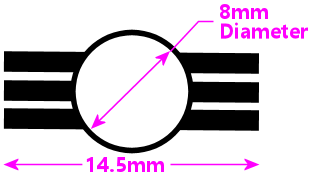
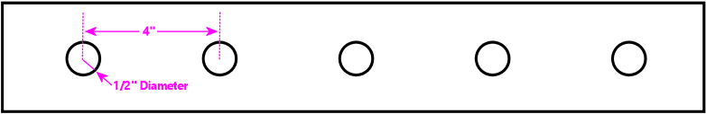
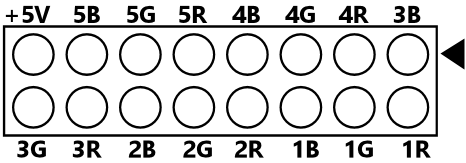
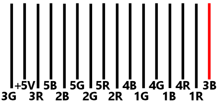

# Flasher Panel Circuit Board

This circuit board implements a 5-way flasher panel of the type that's
most common in virtual pin cabs.  It uses five high-current (350mA) RGB
LEDs, spaced in a single row at 4" intervals.

This board was designed with [EasyEDA Pro](https://pro.easyeda.com).  (Most
of my boards are designed with EAGLE, but the "amateur" version of EAGLE
that I use doesn't allow boards this large.)  I've also provided the Gerber
files, which are the standard format that almost all PCB fabricators accept.

## Parts sourcing

The project includes a Bill of Materials (BOM) in CSV format.
All of the parts **except the LEDs** are available from [Mouser](https://mouser.com).

The LEDs are a little harder to source in the US market.  The particular part
used in the board layout is Xinglight XL-HD6070RGBC-A46L-BD, and none of the US
distributors (Mouser, DigiKey, etc) stock these LEDs, or even anything in the
same class.  They seem to only be available from Asian distributors, such as
[LCSC](https://lcsc.com), and are also currently available on
[AliExpress](https://aliexpress.us).  I couldn't any find exact matches on
Amazon or eBay, but there are near matches that would fit the footprint - search
for **3W RGB LED**, and look for the type with 6 leads that's **not** attached
to a "star" heat sink base, 8mm diameter body, 14.5mm overall lead length.  The
following Amazon listings (March 2025) appear to be compatible, including using
the same resistors as the Xinglight:

* Chanzon LED 3W RGB 6 pins, ASIN B01DBZIW8W

* Vrabocry LED RGB, 3x1w 6pin RGB style, ASIN B0CXF5YTQ7

Match these dimensions:

<b>Different resistors might be required</b> if you substitute a different
LED.  Consult the LED data sheet to get the forward voltage (VF) and
forward current (IF) for each color channel, then plug these values
into an LED resistor calculator (several are available online).  Enter 5V as the
supply voltage.  The calculator should tell you the resistor size (Ohms and
Watts) required for each color channel.  In most cases, this should give you
values around 10 Ohms/2 Watts for the Red channel, and 5 Ohms/1 Watt for the
Blue and Green channels.  If the results come to roughly these values (within an
Ohm or so), you should be able to use the resistors listed in the BOM.  If not,
select the appropriate replacement resistors.  You'll have to match the
resistance value, the required minimum wattage (typically 1W for blue/green and
2W for red) and the "SMD case code", which is 2512 (that specifies the physical
size of the resistor).  Note that there's a case code called "2512 Reversed"
that's **not** compatible with regular 2512, so don't select one of those.

## Physical layout

This is designed to sit behind a wood panel, made from 1/4" to 1/2"
plywood or MDF, with this layout:

The circles represent 1/2"-diameter drill holes, spaced at 4" intervals.
The overall panel dimensions are up to you.  If the panel will sit above the
playfield TV at the back of the cabinet, make the width about 1/4" less than
the overall inside cabinet width, so that it fits the width of the cabinet
with a little room left over to position it.  The height of the panel depends
entirely on your layout.

Attach the circuit board to the back of the panel using three #6 wood
screws (choose a length according to the thickness of the panel
material) and matching flat washers.  Fasten at the holes in the
circuit board.  Align the LEDs with the 1" round holes in the board.
The LEDs face forward, through the holes in the panel.

On the front side of the board, attach a standard plastic flasher dome over
each LED.  Select the "with screw tabs" type, clear, Williams/Bally part number
03-8149-13.  You can find these at [Marco Specialties](https://www.marcospecialties.com/),
[Pinball Life](https://www.pinballlife.com/), [Planetary Pinball](https://www.planetarypinball.com/),
and other online pinball vendors.

## Connecting to a controller

The 16-pin connector is designed to mate with a standard 2x8 pin, 0.1"
pitch IDC cable connector, and standard 1.27mm pitch, 28 AWG, 16-wire
ribbon cable.  The connectors and ribbon cable are basic electronics
supply staples that are widely available.  You should be able to find
them at electronics vendors (Mouser, DigiKey) and many general retailers
(Amazon, eBay).

If you're using a Pinscape Pico or KL25Z expansion board, the connector
on this board uses the same layout as the expansion board Flasher port.
If you're connecting to an LedWiz or some other kind of expansion board,
you'll need to create your own connector at the source end that matches
the layout of the flasher board connector.

The 16-pin connector uses the following pin assignments.  This is a
top view of the pin header. +5V is the positive power supply input,
which is connected to all of the LEDs.  "1R" is the Red channel of LED
#1 (the leftmost LED), "1G" is the Green channel, "1B" is the Blue
channel, and so on.  The LEDs are numbered #1 to #5, left to right.
The arrow in the diagram corresponds to the arrow printed on the circuit
board, which is the nominal "pin #1" on the header.

When you connect this to a ribbon cable with an IDC connector, the pins
connect to the wires alternating between the two rows, so the ribbon cable
will have the following wire assignments:

The rightmost wire is shown in red because this is the nominal "pin #1"
position on the header, and it's conventional to mark the side of the
ribbon cable that lines up with pin #1 with a red stripe.  That helps
make sure that the cable is plugged into the port in the correct orientation.
Pin #1 is also marked on the circuit board with a pair of arrows.

## SMD parts

This board uses SMD parts for the LEDs and resistors.  Suitable LEDs are
only available in SMD form, so there was no option to make this part any
friendlier for hand-soldering.  I chose to use the SMD resistors to keep
the board flatter, to make it easier to mount to the flasher panel; through-hole
parts always have little nubs that stick up from the back, which makes the
board harder to mount flush.  As SMD parts go, these resistors are quite
easy to work with, because they're fairly large.

You should be able to solder them by hand with a soldering iron and
the same solder you'd use for through-hole parts, but if you have
solder paste and a heat gun available, that's probably even easier.
Just put a dab of solder paste on each pad, then position each
resistor on top of the paste (tweezers help with that), pressing it
down gently to make sure it sticks.  Then hit it with the heat gun
until the solder paste melts and turns shiny.

To solder with a regular soldering iron, melt a little solder onto
a pad, I think the easiest technique is to attach one pad first to
lock the resistor in place, then solder the other pad.  Melt a little
solder onto the first pad, then, with the solder still liquid, move the
resistor into position.  Once it's positioned properly over both
pads, let the solder cool and solidify.  The first pad will hold the
resistor in place, so now just heat the other pad and melt some solder
one it to complete the job.  You can use the same technique to attach
the LEDs, starting with one pad to lock the LED in place, and then
soldering the other pads one at a time.

