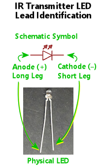
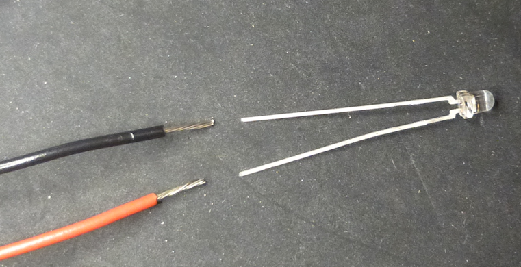
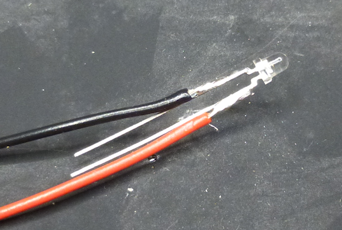
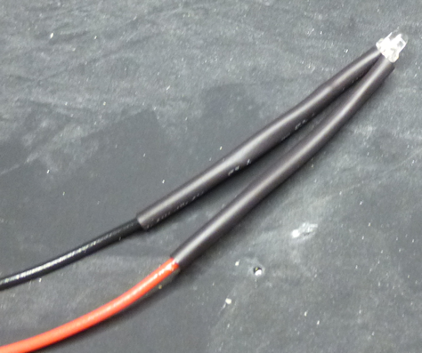
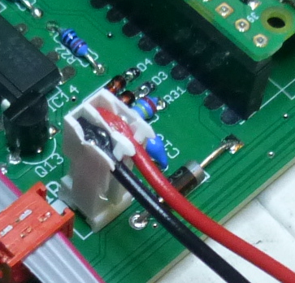
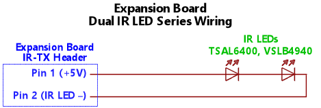

# IR Transmitter for Pinscape Pico

As with the IR Receiver function, the expansion boards are designed to
use a "satellite" IR Transmitter, connected to the main expansion board
with a cable, so that you can locate the transmitter some distance
from the main expansion boards.  This lets you position the transmitter
somewhere in line-of-sight to the TV or other devices that you want to
control with it, regardless of where the expansion board itself is
located.

Unlike the IR Receiver, though, the IR Transmitter doesn't have its
own circuit board design.  This is because the transmitter only
requires a single part, an IR LED.  I figured that there wasn't any
point in making everyone go to the trouble and expense of ordering a
separate circuit board that would hold just this one part, given that
it's really just as easy to solder wires to the LED directly.

## Parts

As of this writing, the BOM (the Bill of Materials, or parts list) has
two options for the IR LED: TSAL6400, or VSLB4940.  You'll find these
listed in the BOMs for the DIY-Friendly Main board and the Pro board.
They're not assigned reference designators ("R3", "IC7", etc) because
they don't get soldered directly to the expansion boards - as mentioned above,
they're connected with cables as satellite parts.  You can use either
of the listed parts (TSAL6400, VSLB4940) interchangeably - they'll
both work the same way without making any changes to the expansion
boards.  The VSLB4940 is a newer device with slightly better specs
than the TSAL6400, so that's the one I'd go with, assuming that
price and availability are similar.

You'll also need the 2-pin MTA-100 plug (known more formally as a
"wire housing") that connects to the IR-TX port on the expansion
board, which you'll also find on the expansion board BOM.  This is
where you connect the other ends of the wires that run out to the IR
LED.

And, of course, you'll need the two hookup wires to serve as the
cabling between the expansion board and the IR LED.  Use stranded wire
that matches the gauge (the AWG number) of the MTA-100 wire housing
you select. The one in the BOM is for 24 AWG wire, but they make
housings for the same connector for various other gauges, if you
prefer to use a different wire size.

Use whatever length of wire you need to reach from the expansion board
to the location where you're planning to position the IR LED.  About 6
ft (2m) should be enough to reach just about anywhere in a pin cab,
but you should measure it out based on your actual install locations
to be sure.

You need two wires of the same length.  Use a different insulation
color for each wire to help keep straight which wire connects to which
LED leg, since LEDs are polarized devices ("+" on the LED must go to
"+" on the expansion board port and "-" must go to "-").

## Assembly

Wiring the IR LED is very simple.  As describe above, cut a pair
of wires to the desired length.  Solder one wire to the (+) terminal
of the LED, which is the <b>longer</b> leg.  Solder the other wire
to the (-) terminal, which is the <b>shorter</b> leg.

I like to use red wire for the (+) terminal and black for the (-)
terminal, since "red is positive, black is negative" is the almost
universal convention for simple polarization cases like this.  But
the insulator color makes no difference to the electrons, so use
whatever makes sense to you (or whatever you have on hand).

To keep things compact, strip about 1/4" of insulation from the
wire, and solder the wires near the base of the LED.  This will
let you trim off most of the length of the legs after soldering,
making for a nice compact package.

After soldering the wires and trimming the excess length from
the legs, insulate the exposed wire with either electrician's
tape or heat-shrink tubing.  I find heat-shrink tubing to be
a lot more durable - electrician's tape tends to lose its
stickiness and start peeling after a couple of years.

Connect the other ends of the wire to the 2-pin MTA-100 housing that
mates with the IR-TX header on the expansion board.  Assuming that
you're using the IDC connector listed in the BOM, this is just a
matter of squeezing the wires into the knife terminals on the top
of the connector.

There's a special tool for placing wires in these IDC headers:
(https://www.pinballlife.com/100-254mm-idc-wire-insertion-tool.html).
But a thin flat-blade screwdriver works reasonably well if you
don't want to spend the money for a tool that just does the one thing.
Be sure that the wires are forced into the terminals far enough that
the knife edges cut through the insulation, since that's what
establishes the electrical connection *and* what holds
the wire in place mechanically.

## Using two IR LEDs in series

Optionally, you can use two IR LEDs, wired in series.  This can be
used for two purposes: to double the brightness of the emitted IR
light, which will increase the distance that the signal will reach; or
to set up two transmitters in separate locations to reach two target
devices that aren't facing the same direction.

If you just want to increase the brightness, position the two LEDs
right next to one another, facing the same direction.

Alternatively, you can place the two LEDs in arbitrary separate
locations, so that each one is in line-of-sight to a different target
device.  This can be useful if the two receiver devices are situated
such that there's no single location that has good line-of-sight
access to both.  This is not unheard of with virtual pinball cabinets,
where you have multiple displays, facing different directions, and all
somewhat recessed in the cabinet woodwork.

In either case, wire the two LEDs in series, as shown below.

Note that the series arrangement will only work if the Forward Voltage
rating on the IR LEDs, listed in the data sheet under the symbol <b>Vf</b>,
is no higher than about 1.9V.  Both of the IR LED options listed in the BOMs
satisfy this requirement.
