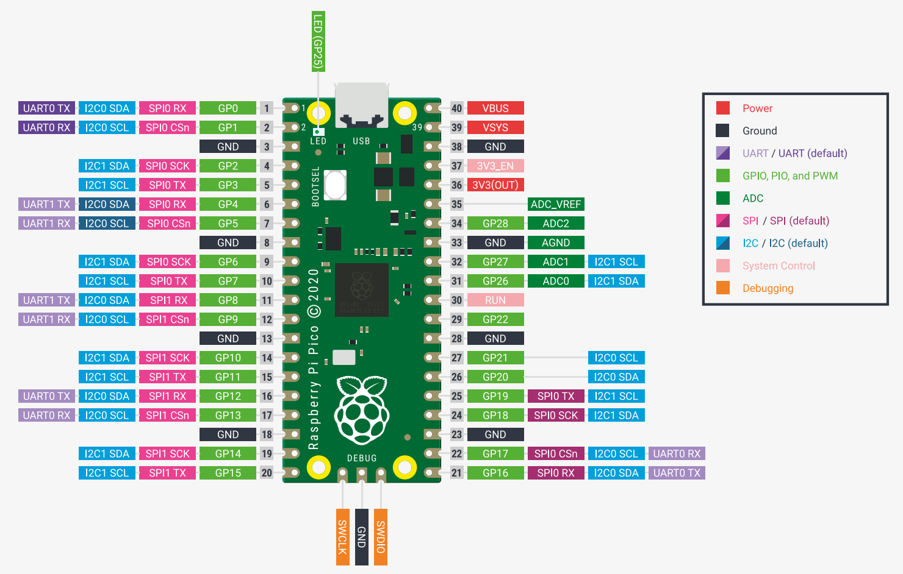
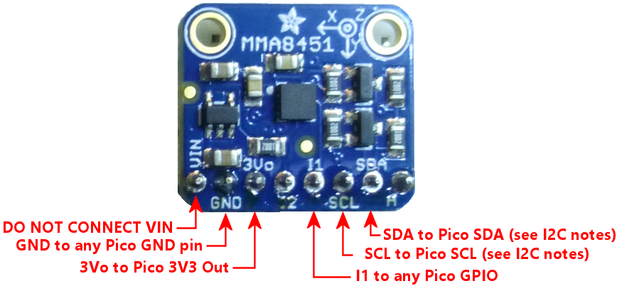
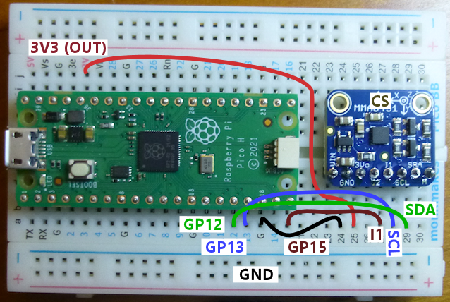
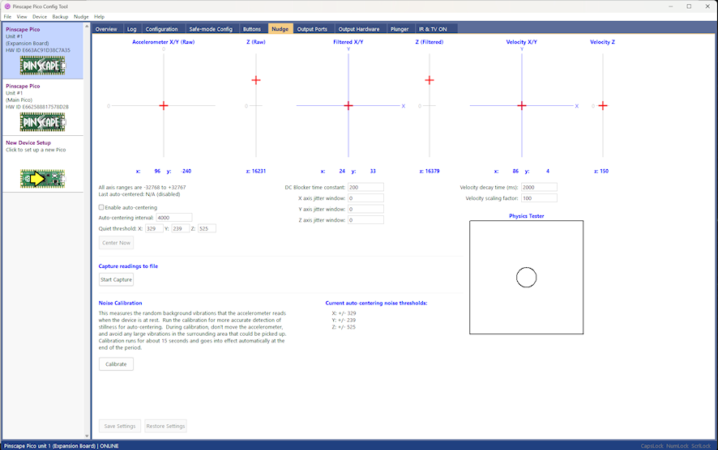
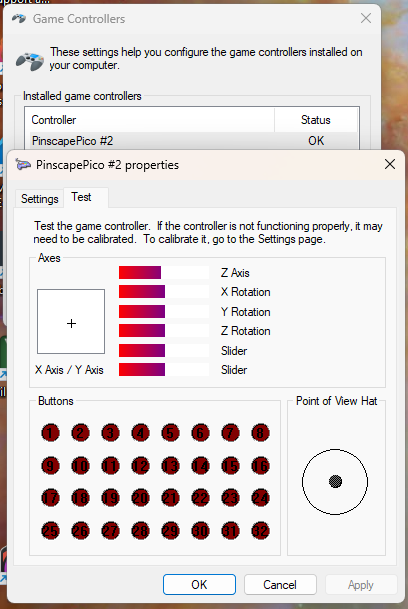

# MMA8451Q Setup Guide

This is a quick guide to setting up an MMA8451Q accelerometer with a
standalone Pico.  MMA8451Q is the accelerometer chip that was
built into the venerable FRDM-KL25Z microcontroller board, which
was the platform that the original Pinscape Controller software
ran on.

MMA8451Q is no longer in production, but you can still buy them as of
this writing (mid 2025), because Adafruit still has an inventory of
their MMA8451Q breakout boards in stock.  The MMA8451Q is the best
current option for Pinscape Pico accelerometers in terms of
measurement accuracy, so if you're thinking about building a nudge
device into your pin cab, you should go out and buy the Adafruit
board now, while they're still available.

If you're using a newer version of my DIY Expansion Board design, you
won't need to go through the extra steps here, because the DIY board
has a slot pre-wired for the Adafruit MMA8451Q breakout board.  Just
build the expansion board, and plug the Adafruit board into the
special slot.  Note that the slot is specifically designed for the **Adafruit**
MMA8451Q breakout board, so you must use that specific product.  Generic
MMA8451Q boards from Amazon or eBay or AliExpress probably won't have
the same pin layout and so won't work.

If you're reading this material some years after I wrote, and you find
that the MMA8451Q is no longer available, the next device to try is
probably LIS3DH, which is (as of 2025) in production and widely available.
See [LIS3DH Setup](LIS3DH-Setup.md).


## Pico pin-out diagram



## Adafruit MMA8451Q board diagram

If you're using an MMA8451Q board from some other vendor, it might not
have exactly the same pin layout, but all of the same pins should still
be there, possibly in a different order and with different labels.  There's
no way I can show you a diagram of every other board that might be out
there, so I'll have to leave it up to you to make the translation from
the Adafruit layout shown above.




## Wiring the chip

All MMA8451Q breakout boards should have the following external pins, which
should be connected as follows:

* 5V input, labeled **5V** on the Adafruit board.  **DO NOT CONNECT this pin.**
The Pico is a 3.3V platform, so you **must not** connect this pin when using the chip with a Pico.
(Non-Adafruit boards might not have a 5V input.)

* 3.3V power input, labeled **3VO** on the Adafruit board (it might be **3.3V** or **3V3** on other boards).
Connect to the Pico 3.3V power output pin (3V3 OUT, pin 36).

* GND (ground).  Connect to any GND pin on the Pico.

* SCL.  See the I2C connection notes below.

* SDA.  See the I2C connection notes below.

* Interrupt 1, labeled **I1** on the Adafruit board (it might be **INT1** on other boards)
Connect to any free GPIO pin on the Pico.  You can optionally leave this disconnected, but
it improves overall Pico software performance if you connect it.

* SA0 (labeled **A** on the Adafruit board).  Connect to GND to select I2C address
0x1C.  Connect to 3.3V (same as VIN) or simply leave unconnected to select address 0x1D.

Some boards have other pins as well, and in most cases, you can leave these disconnected.
But if your board came with instructions or a wiring diagram, pay attention to what they
say instead of my one-size-fits-all advice here.

### Sample breadboard wiring



### I2C connections

This chip communicates with the Pico via a bus protocol known as I2C.  This requires two
connections to the Pico, labeled **SDA** and **SCL** on the chip.

I2C on the Pico only works on **certain combinations of GPIO pins**.  In particular, the SDA and SCL
pins that you choose must be paired to the same I2C unit on the Pico.  The Pico has two
I2C units, called I2C0 and I2C1.  The pins you choose for SDA and SCL must come from
the **same unit**.  So if you pick an I2C0 SDA pin, you must also choose an I2C0 SCL pin.
Likewise, an I2C1 SDA pin must be paired with an I2C1 SCL pin.

How can you tell which pin goes with which I2C unit?  Just look at a Pico pin-out diagram.
Each pin is labeled with a legend like **I2C0 SDA** or **I2C1 SCL**.  Just pick a pair of
pins, SDA and SCL, that are attached to the same I2Cx unit.

For example, GP0 and GP1 are attached to I2C0 SDA and I2C0 SCL respectively, so you can
use these as your I2C pins.

Once you choose, just wire the SDA pin from the MMA8451Q board to the chosen SDA GPIO pin
the Pico, and likewise, wire SCL from the MMA8451Q to the chosen SCL GPIO on the Pico.

## Pinscape configuration setup

There are two sections in the JSON configuration that you have to set up to use
this chip: `i2c0` or `i2c1`, and `mma8451q`.

The first section configures the I2C unit.  An I2C bus can have
several devices attached, so Pinscape separates the I2C configuration
from the device configuration - you need a whole section in the config
just for the I2C unit setup.  The same I2C section can then be shared
by multiple devices, if you have more than one I2C device connected to
the same bus.

The I2C section looks like this:

```
i2c0: {
   sda: 0,          // the GPIO port number where you connected the chip's SDA pin
   scl: 1,          // GPIO port connected to the chip's SCL pin
   speed: 400000,   // bus speed - most chips operate at 400000
   pullup: true,    // enable the Pico's internal pull-up resistors on SDA and SCL
},
```

The "0" in `i2c0` is the unit number, which must match the pins you selected in
the wiring.  If you used pins that are labeled as I2C1 pins in the Pico diagram,
change this to `i2c1` instead.

If your MMA8451Q board has its own pull-up resistors built-in, which many of these boards do,
you can omit the `pullup: true` part.  But it doesn't usually do any harm to include it
one way or the other.  An I2C bus *always* requires pull-up resistors on those lines, so
most boards include them, but some leave it up to you to provide them to give you more
flexibility in choosing the resistor size (which matters more when you have several
devices attached to the bus).

The second section sets up the MMA8451Q unit itself.

```
mma8451q: {
   i2c: 0,        // which I2C unit you're using - 0 if you connected the device to I2C0 pins, 1 for I2C1 pins
   addr: 0x1D,    // the chip's I2C address - 0x1C if you connected "A" (SA0) to GND, 0x1D if you connected it to 3V3 OUT or left it unconnected
   interrupt: 22, // the GPIO port number where you connected the INTERRUPT (INT or INT1) pin - OMIT IF NOT CONNECTED
   gRange: 2,     // the "g" range to select - 2 selects +/- 2g, which is the most sensitive setting, and usually the best for virtual pinball
},
```

## Nudge setup

The JSON configuration has one more section required to set up nudging: the "nudge device".
This is a Pinscape Pico abstraction that processes the accelerometer input and turns it
into "nudge" data for the pinball simulator programs.  It has its own settings, which
go under the `nudge` section in the configuration.

```
nudge: {
   x: "+X",        // map the chip's physical X axis to Pinscape's X axis (left/right)
   y: "+Y",        // map the chip's physical Y axis to Pinscape's Y axis (front-to-back)
   z: "+Z",        // map the chip's physical Z axis to Pinscape's Z axis (vertical up/down)
},
```

The axis mapping lets you compensate for the orientation of the MMA8451Q chip in the cabinet.
If you look very closely at the Adafruit board, it has a very small arrow with a "Y" printed
on top, showing the direction of the physical chip's Y axis relative to the carrier board.
In the virtual pinball world, the "X" axis represents left/right motion across the width
of the cabinet, and the "Y" axis represents the front-to-back motion along the length
of the cabinet.  Pinscape also has a "Z" axis, which represents the vertical up/down
direction.  The vertical axis isn't used in most virtual pinball programs, but it's a
feature of most of the accelerometer chips, so Pinscape takes it into account just in
case a future simulator ever makes use of it.

You can start with the mappings shown above, but you can map any physical chip axis
to any abstract nudge device axis.  And if an axis is backwards in the pinball simulation,
you can fix that by changing "+X" to "-X", for example.

## Gamepad setup

Believe it or not, we're still not quite done with the JSON setup.  We now have the
physical chip's data input handled, and the logical "nudge device" inputs mapped, but
we still have to tell Pinscape how to send the nudge data to the PC.

The standard way to do this in almost all current pinball simulators is via a
virtual gamepad (also known as a joystick).  Almost all of the simulators are able
to accept nudge input on the X and Y gamepad axes.  So, we have to first **enable**
the gamepad, so that Pinscape presents the PC with an imaginary gamepad device,
and then we have to **map the gamepad axes** to the nudge device.

```
gamepad: {
   enable: true,       // enable the simulated gamepad device on the USB interface
   x: "nudge.x",       // map the gamepad's X axis to the nudge device's X axis
   y: "nudge.y",       // map the gamepad's Y axis to the nudge device's Y axis
   z: "plunger.z",     // if you also have a plunger, this maps the Z axis to report the plunger position
},
```

### Sample JSON file

Here's a complete but very stripped-down configuration file showing the
settings described above.  The GPIO ports are set to match the breadboard
wiring shown earlier.

```
{
   i2c0: {
      sda: 12,
      scl: 13,
      speed: 400000,
   },

   mma8451q: {
      i2c: 0,
      addr: 0x1D,
      interrupt: 15,
      gRange: 2,  
   },
  
   nudge: {
      source: "mma8451q",
      x: "+X",
      y: "+Y",
      z: "+Z",  
   },
      
   gamepad: {
      enable: true,
      x: "nudge.x",
      y: "nudge.y",
   },
}
```

## Testing

The first step to testing the setup is to look at the Nudge window in the Pinscape
Config Tool.  Launch the config tool, click on the device in the list on the left,
and then click on the Nudge tab to bring up the Nudge Tester window.



The simple test to perform here is to observe the **Accelerometer X/Y
(Raw)** graph, and make sure the red crosshairs moves when you nudge
the MMA8451Q board.  When you apply side-to-side accelerations to the
board, you should see the crosshairs move left and right.  When you
apply front/back accelerations to the board, you should see the
crosshairs move up and down.

If the crosshairs are moving, but in the wrong directions, you just
need to adjust the axis mappings in the `nudge` section in the configuration.

### Gamepad input testing

A second test you can perform is to run the Windows gamepad viewer
control panel.  Press Windows+R to bring up the Run box, type **JOY.CPL**,
and press Enter.  This will bring up a list of gamepad devices; find
the Pinscape Pico entry, and double-click it.



You can now repeat the physical "nudge" tests, this time observing
the **X Axis / Y Axis** crosshairs in the joystick viewer.  You should
see the crosshairs move side-to-side when you move the MMA8451Q board
side-to-side, and up/down when you move the MMA8451Q board front-to-back.

Again, if the directions are wrong, you can fix it easily by changing
the axis mappings in the `nudge` settings in the configuration.


### DO NOT USE WINDOWS CALIBRATION

There's a super important warning I have to give you here: **NEVER EVER EVER**
click the "Calibrate" button in the Windows joystick viewer.  If you do that, it
will make the nudge behave erratically in the pinball simulators.  Joystick
calibration is only designed for **real joysticks**, and it wreaks havoc with
our fake nudge joysticks, making their readings all screwy in the pinball games.

#### "Oops, what if I already clicked Calibrate?"

If you accidentally clicked the Calibrate button at some point (or suspect you
might have), you can easily undo it.  Go back to JOY.CPL, click the Settings
tab, and then click **Reset to default**.  That deletes the calibration data
collected when you clicked the Calibrate button.

## Cabinet installation

The MMA8451Q board should be installed flat on the floor of your cabinet, square
with the cabinet walls.  The rotation doesn't matter, since you can always remap
the axis assignments to match the orientation, but it's important to have the
sides of the board parallel to the walls of the cabinet, so that one MMA8451Q
horizontal axis is aligned with the side-to-side motion of the cabinet, and
the other is aligned with front-to-back motion.  If you install the board
at an angle, front-to-back and side-to-side motion will both be mixed into
the readings on both MMA8451Q horizontal axes, which will make the nudge response
muddy at best.

The board should be attached securely to the cabinet floor, so that the device
moves in lock step with the cabinet.  The whole point is to track the motion
of the cabinet itself, so the accelerometer has to essentially be part of the
cabinet.  Make that so by attaching it firmly to the cabinet floor.  You can
just screw the board down directly, or you can install it on standoffs.

As for positioning within the cabinet, the best place is somewhere towards the
front of the cabinet, roughly centered side-to-side.  If you have a coin box,
directly behind the coin box is a good place.  Exact placement really isn't
critical, but installing the device towards the front of the cabinet is best,
because the side-to-side nudges you apply during the game will have the biggest
effect on the front part of the cabinet.


## Visual Pinball setup

In Visual Pinball, nudge input is mapped in the **Keys, Nudge and DOF** dialog.
In the menu, select **Preferences** > **Configure Keys, Nudge and DOF...**

For standard joystick mappings, select:

* X Axis (L/R) = X Axis, X-Gain = 1000
* Y Axis (U/D) = Y Axis, Y-Gain = 1000
* Dead Zone = 0%
* Enable Analog Nudge = Checked
* Normal Board Mounting Orientation = Checked

You'll have to experiment with the X-Gain and Y-Gain settings to get the proper
nudge strength.  The Gain settings are arbitrary scaling factors that control
how strong the effect on the simulation is, and there really isn't a one-size-fits-all
setting.  VP provides a Nudge Test Table that you can use to judge the effect, so
you should find that (it should come with your VP installation) and run it to
dial in settings that you like.

This is another place where you can adjust for orientation differences.  When
you run the Nudge Test Table, you can make sure that the motion is as expected,
and rotate or reverse axes in the VP mappings if things go the wrong direction.
