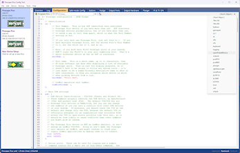
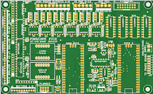
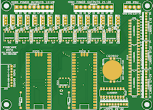

# 

Pinscape Pico is a comprehensive I/O controller for virtual pinball
cabinets, designed for the Raspberry Pi Pico RP2040.  It handles
nearly all of the common input and output functions in a virtual pin
cab: arcade-style pushbuttons and switches, accelerometer-based
nudging, mechanical plunger position sensing, and feedback effect
devices such as lights, shaker motors, fans, and solenoids.  It can be
used on a standalone Pico, and also with a wide range of peripheral
devices that expand the Pico's hardware capabilities: accelerometers,
PWM/LED driver chips, shift registers, GPIO expanders, ADCs, and
clock/calendar chips.  The project includes hardware designs for a
number of expansion boards that implement particular collections of
peripherals selected to meet the needs of most pin cab builders.

This project is a sequel to the original [Pinscape KL25Z controller](https://github.com/mjrgh/Pinscape_Controller),
but it's all new code, not a port of the KL25Z software.  The Pico is
a more powerful platform than the KL25Z, so I wanted to make a fresh
start to take advantage of the Pico's expanded capabilities.  Pinscape
Pico has all (I'm pretty sure) of the features of the original KL25Z
Pinscape, plus some neat new tricks.  It's a little more "technical"
than the KL25Z system, but also more powerful and flexible.

## What can you do with it?

Here are some examples of how you can set up a Pinscape Pico system.
There's a more comprehensive list of features a little later in this
article, but it might help to start with some more concrete examples
of what your overall system might look like.

* <b>Button controller:</b> A really simple way to use Pinscape is as
a button encoder, for connecting arcade pushbuttons to the PC.  The
Pico is the only piece of hardware you need for this, since you can
just connect the buttons directly to the Pico's GPIO ports.  The Pico
has a total of 26 external GPIO pins, so you can connect up to 26
buttons.  Each button can be mapped to the PC as a keyboard key, a
gamepad button, or a variety of other options, and the Pico responds
to button presses within microseconds, for very small latencies
sending input to the PC.  (If you need more than 26 buttons, there are
also options to add just about as many extra ports as you'd like by
adding some external chips, but that's not required if you can make do
with 26 buttons.)

* <b>Accelerometer-based nudge device:</b>  A slightly more complex
setup adds an accelerometer, to detect when you nudge the cabinet,
so that the pinball simulator can apply the nudge force within the game.
Analog nudging adds a wonderful extra dimension to video pinball
that lets you interact with the game in a much more natural,
physical way.  The Pico doesn't have a built-in accelerometer,
though, so this setup requires adding an external accelerometer.
Fortunately, Adafruit and Sparkfun make inexpensive (under $10)
breakout boards for the popular LIS3DH chip, which is relatively
easy to connect to the Pico and works well with Pinscape.  You
can combine this with button inputs, too (although you'll only
get 24 buttons in this case, because the accelerometer connection
takes up two of the GPIOs).

* <b>Plunger:</b> You can also add a mechanical plunger position
sensor.  Apart from the plunger sensor itself, no other hardware
is needed.  The simplest plunger sensor type is a slide potentiometer,
which connects to the Pico with three wires.  You can combine this
with the accelerometer and button functions as well.

* <b>Feedback device controller:</b> Pinscape can act as a replacement
for the LedWiz and its competitors - devices that control a fixed set
of feedback devices, and do nothing else.  Pinscape can even emulate
the original LedWiz USB interface, if you want it to, which makes it
plug-and-play compatible with old LedWiz-based software.  To control
feedback devices, though, you need to add some custom external
hardware, because the Pico by itself can only control tiny amounts of
power, just enough for a small LED.  So you need "booster" (amplifier)
circuitry to control motors, solenoids, and bigger lights.  Pinscape
is flexible enough to work with a wide range of booster circuits, so
you can roll your own if you want, but you don't have to.  The
Pinscape Pico project includes several "reference" expansion board
designs, which are open-source circuit board layouts that anyone is
free to build on their own, or to customize to fit specific
requirements.

* <b>Comprehensive I/O controller:</b> The reference expansion boards
don't *just* control feedback devices.  They're designed as **all-in-one**
boards that handle just about everything you'd need in a full-featured pin
cab, including accelerometer, plunger, buttons, and feedback devices.
So you can combine the features of a button encoder, nudge device, and
feedback controller into a single Pico running Pinscape.

## Quick setup guide

A pre-built Windows installation is available on the github project page,
under the **Releases** section in the right panel.

The distribution is a ZIP file.  To install, just unpack the ZIP file
into a local directory on your hard disk.  Just about any folder
location will work, except that you should avoid any of the Windows
system folders and the C:\Program Files tree, since those folders
are protected.

Once you unpack the files, you can launch the Pinscape Pico GUI Config
Tool by double-clicking **GUIConfigTool.exe**.  That's designed to be
your main gateway to the system, and it'll display on-screen
instructions for setting up a new Pico with the Pinscape software.

More setup details can be found [below](#SetupDetails).

## Features

* USB keyboard emulation, for button input mapping

* USB gamepad emulation, for button inputs, accelerometer, and plunger

* XBox controller emulation ("XInput"), as an alternative to the HID gamepad
(and the controller's feedback features (LEDs and rumble motors) can be mapped to
output ports via the "computed output" feature)

* [Open Pinball Device](http://mjrnet.org/pinscape/OpenPinballDevice/OpenPinballDeviceHID.htm) support

* All input devices (keyboard, gamepad, XBox, Open Pinball Device) are optional, they can be mixed
and matched in any combination, and and all of their virtual controls (buttons,
joystick axes) can be individually mapped to whichever physical inputs you like
(physical buttons, accelerometer axes, plunger sensor)

* Support for PWM outputs directly through Pico GPIO ports, as well as
multiple external PWM output controller chips (TLC5940, TLC59116,
PCA9685), and even shift-register chips (74HC595)

* Gamma correction option for PWM output ports, with the gamma
calculated at the device's full resolution for higher-resolution
devices (e.g., 12-bit gamma scaling for TLC5940)

* Configurable "flipper logic" timer protection (in software) for all output ports

* Support for shift register output ports via 74HC595, which can be configured
as digital ON/OFF outputs or as PWM outputs

* Support for digital ON/OFF output ports via PCA9555 GPIO expander chips

* An add-on project, "PWMWorker", turns additional Picos into 24-port
I2C PWM controllers, the equivalent of 1&half; TLC59116 or PCA9685
chips, but in the DIY-friendly Pico package, and at the DIY-friendly
Pico price point.  Add more PWM ports to your system, 24
at a time, without any SMD soldering ([Data Sheet](http://mjrnet.org/pinscape/PWMWorker/DataSheet/PWMWorkerDataSheet.htm) &bull; [Project subtree](PWMWorker))

* Support for button inputs directly through Pico GPIO ports, as well as through
74HC165 shift registers and PCA9555 GPIO expanders

* Extremely low latency on GPIO and 74HC165 input ports (microseconds on the
device side, 1-2 milliseconds end-to-end delivery to the application through USB)

* Ports on PCA9555 chips can be individually assigned as button inputs ports and
feedback device output ports, freely mixing port types on the same chip

* An extensible design for all of the external hardware interfaces, to allow
new chips to be added in the future

* "Logical button" design that allows mapping multiple types of physical inputs to
multiple types of PC inputs and other actions, including keyboard keys, gamepad buttons,
IR remote control code transmissions, and internal actions such as engaging Night Mode
or firing an output port

* Button macros, to carry out a timed series of actions when a button (physical or logical) is pressed

* "Shift buttons", to allow mapping multiple functions to a single physical input; multiple
shift buttons can be defined, to allow for shift "chords" (analogous to PC key combinations like Shift+Ctrl+X)

* "Logical output" design that allows mapping physical outputs to DOF ports, internal sources, and
"computed" sources that let you combine DOF ports, control multiple things with one DOF port,
control ports based on timed events or internal device events, and all sorts of other things

* Native DOF support, via Pinscape Pico device recognition in DOF (present in unified R3++ DOF releases since late 2024)

* Support for legacy LedWiz-only applications, via two levels of emulation:
  <ul>
    <li>Windows API-level emulation, via an open-source LEDWIZ.DLL replacement.  This is the preferred method, since it's compatible with all of the other Pinscape features.
    <li>Full USB protocol emulation, for systems or applications where the LEDWIZ.DLL replacement can't be used.  This is a last resort when the first option doesn't work, because it restricts what other Pinscape features you can use.
  </ul>
    
    These two approaches are mutually exclusive, and have certain trade-offs.
    See [LedWiz Emulation Options](LedWizEmulationOptions.md) for more details.

* Night Mode, to disable designated outputs as a group for quieter play

* Time-of-day features, and support for an external real-time clock (RTC) chip to keep time
while the power is off

* IR remote control receiver/transmitter, with the full universal-learning-remote design from the KL25Z Pinscape

* The "TV ON" feature from the KL25Z Pinscape, with support for the same type of external power-sensing circuit,
and the same support for a TV Relay and IR command activation when a power-on transition occurs

* Plunger sensor support for all of the KL25Z Pinscape sensors, with the same plunger logic features

* Nudging, with support for multiple accelerometer chips (MXC6655XA, MC3416, LIS3DH, LIS3DSH),
with an extensible design to allow support for more accelerometer chips to be added in the future

* Nudge Velocity input support for the latest Visual Pinball

* Plunger and accelerometer inputs can be mapped to any suitable gamepad axes, and can also be used
as inputs to logical buttons and logical output ports; for example, you can set up a button that
triggers when the accelerometer X axis exceeds a given threshold, or set up an LED that turns on
when the plunger is pulled

* Plunger Velocity input support for the latest Visual Pinball

* Extremely flexible configuration system, with practically all of the
hardware setup under user control, using the human-friendly JSON text file format

* Detailed error/status logging, viewable on the PC via UART (physical serial port), USB CDC (virtual COM port),
and the Config Tool, for easier troubleshooting

* A simple command console, accessible through UART and USB CDC ports, with access to internal
debugging and troubleshooting commands; mostly a debugging tool for developers, but possibly useful
for troubleshooting problems that don't easily yield to other means

* GUI configuration and testing tool, with detailed visualizations of hardware
and software status for button inputs, feedback device outputs, plunger sensor, and IR features

### Non-features (things Pinscape Pico doesn't do)

Pinscape Pico is billed as a "comprehensive" I/O controller for
virtual pinball cabinets, but there are a few I/O functions that
Pinscape doesn't handle.  In each case, the decision to omit them was
based primarily on the resource limits of the Pico: there would be too
many compromises trying to make a single Pico perform all of its
Pinscape duties *plus* these other tasks.  Fortunately, all of these
functions are already covered by other open-source projects that run
on similarly inexpensive hardware, so leaving them out of Pinscape
shouldn't be an obstacle to including them in a DIY pin cab.

* **No smart light strips:** Pinscape doesn't control smart light
strips - the kind with individually addressable RGB LEDs, such as
WS2812B strips.  The resource limit that makes this impractical to
include in Pinscape is the Pico's relatively small number of GPIO
ports.  For a typical pin cab light strip setup, you'd need four to
eight GPIO ports dedicated to the light strips.  Pinscape needs almost
all of the GPIO ports to itself as it is.

* **No Dot-Matrix Displays (DMDs):** Pinscape also doesn't control the
128x32 dot-matrix display panels found in 1990s pinball machines, and
still popular in virtual pinball cabinets.  The main reason to
dedicate a separate controller to the DMD is that it requires a lot of
USB bandwidth, since the DMD is essentially a small video display.  A
separate device with its own USB port is the simplest way to ensure
plenty of bandwidth for everyone.

## Documentation

The main documentation right now is the Config Tool help.  That has extensive
information on the Config Tool itself, with a lot of details on the how the
firmware works.  The JSON Configuration Reference section in particular has
extremely detailed information on all of the features, subsystems, and peripheral
hardware supported.

You can access this from the Help menu in the GUI Config Tool (GUIConfigTool.exe),
or you can simply open **Help\ConfigTool.htm** in your favorite browser.

In case you'd like to just read about the system without actually installing
anything, I've made the same help files available online, at
[mjrnet.org/pinscape/PinscapePico/Help/ConfigTool.htm](http://mjrnet.org/pinscape/PinscapePico/Help/ConfigTool.htm)

## More details on installation

### Initial Pico firmware installation

The Pinscape Pico Config Tool guides you through the initial setup process for a new
device.  Just run the program and follow the on-screen instructions under the "New
Device Setup" section.

If you prefer to carry out the steps manually, without the Config Tool involved,
you can also use the standard, native Boot Loader procedure you'd use with any Pico
software:

* Unplug your Pico from USB (and all other power sources)

* Press **and hold** the button on top of the Pico while plugging it in, then release the button

* You should see the Pico appear on your Windows desktop as a virtual thumb drive

* Drag and drop **PinscapePico.uf2** from the Pinscape folder onto the Pico virtual disk
(or use a COPY command in a DOS box)

The Pico should now automatically reboot into the Pinscape software.  If the
software is working properly, the little green LED on top of the Pico will
blink at about 1 Hz, and the device should appear as a Pinscape Pico unit
in the Config Tool.

After the initial install, you can install firmware updates directly
through the Config Tool without all of the manual steps.

### Configuration

This project's configuration setup is rather different from the KL25Z
Pinscape setup.  Instead of a graphical config tool, Pinscape Pico
uses a text file written in the widely-used JSON format.

The JSON file format and contents are documented in the Config Tool
help.  The Config Tool features an integrated text editor (based on
Scintilla) with JSON syntax-aware coloring and indenting, and
quick linking from the current editing location (based on live
syntax scanning) to the relevant documentation.

When you first fire up the GUI Config Tool and go to the Main
Configuration view, the program will offer a choice of initial
template configurations that you can use as a starting point.
The templates contain many examples of common configuration
elements, commented out, that you can un-comment and edit as
needed to add to your own configuration.

Alternatively, you can also send a config file to the Pico using the
command-line Config Tool, from a DOS box:

`ConfigTool --put-config MyConfig.json --reset`

Replace `MyConfig.json` with the actual name of your JSON file.  The
`--put-config` part installs your JSON file on the device.  The new
settings don't go into effect until you reboot the device, which is
why we also added `--reset` at the end.

### Firmware updates

You can update the firmware using the same procedure as the initial
install, by forcing the Pico into Boot Loader mode via the BOOTSEL
button and manually copying the new UF2 file.

But there's also an easier way.  Once Pinscape is installed, the
Config Tool can install firmware updates for you with a couple of
mouse clicks, with no need to physically unplug the Pico or fuss with
the BOOTSEL button.

In the GUI config tool, the main Overview window has controls for
updating the firmware.

To update the firmware from a DOS box, use the command-line config tool:

`ConfigTool --update PinscapePico.uf2`

That automatically places the Pico into Boot Loader mode, copies
the specified UF2 file into its flash, and reboots the Pico to
launch the updated firmware.

## Safe Mode

Pinscape uses the Pico's hardware watchdog module to automatically
detect most software crashes.  The watchdog is essentially a hardware
timer that performs a power-cycle reboot on the Pico if the software
ever stops responding for more than a fraction of a second.  This is
an excellent way to detect software crashes, freezes, and other
problems that make the software stop functioning correctly, and in
most cases, it prevents the Pico from ever getting into a truly
unresponsive state.

When the hardware watchdog detects a crash, it reboots Pinscape into
Safe Mode.  Safe Mode runs the normal Pinscape firmware, but it
bypasses the usual JSON configuration file, and instead uses a
stripped-down configuration with a minimal number of features enabled.
The idea is that most crashes are caused by specific features in the
software, rather than by the core system software, so disabling most
of the optional features will allow the basic core software to run
without problems.

When Safe Mode is active, the Config Tool can connect to the Pico, and
you can inspect and edit the JSON configuration file.  You can also
use Safe Mode to install new firmware, if you're aware of a newer
firmware version that contains a fix for the crash.

If you suspect that the crash that led to Safe Mode activation was due
to a particular feature, you can use Safe Mode to edit the
configuration file and disable the suspect feature.  If you think it
was due to a setting, but you're not sure which one, you can
experiment with disabling features until you find the one responsible.

If you think the crash was purely random or sporadic, you can just
reboot the Pico and try again.  If the Pico keeps going back into Safe
Mode after each reboot, you probably will need to disable something in
the configuration to get back to normal operation.

By default, Safe Mode uses default "factory" settings for everything.
You can optionally create your own Safe Mode configuration file via
the Config Tool, in the Safe Mode Config window.  This works exactly
like the regular JSON configuration; it's just a separate JSON file
that's loaded instead of the regular one when Safe Mode is triggered.
The Safe Mode config file lets you enable specific features even when
in Safe Mode.  Naturally, you should minimize the features you enable
here, since the whole point is to create a minimal configuration
that's less likely to crash due its very simplicity.  I like to
configure the ID information here to match the main configuration, and
also enable the UART ports, so that I can access the command console
for troubleshooting even when Safe Mode is active.

## Recovering a bricked Pico

First, you can't actually "brick" a Pico, in the sense of rendering it
permanently unrecoverable due to a software error.  But the Pinscape
software certainly can crash, and it can crash at startup, such that
it won't connect to the Config Tool long enough to let you perform an
update.  So the Pico might *appear* to be bricked.  Even this is
unlikely, because the Pico will automatically detect most crashes
and reboot itself into Safe Mode (see above), giving you access to
basic configuration functions.

In the event that Safe Mode doesn't kick in, it's *still* essentially
impossible to truly brick a Pico, thanks to the Pico's boot loader
being etched into inalterable hardware ROM.  No matter how badly the
software screws up, there's just no physical way that it can break
the ROM.  If the Pinscape software ever makes your Pico appear unresponsive,
you can always restore it to Boot Loader condition as follows:

* Disconnect the Pico from USB (and any other power sources)

* Press **and hold** the BOOTSEL button on top of the Pico while plugging in the USB cable

Holding the BOOTSEL button during a power cycle activates the Pico
boot loader, bypassing any software loaded in flash.  Since it's
impossible to erase the boot loader program itself (as it's stored in
unerasable ROM), and since the BOOTSEL button physically bypasses the
flash during the reset, there's nothing that a firmware program can do
to prevent this assertion of Boot Loader control, even if it were
deliberately trying to.

After you perform the BOOTSEL maneuver, the Pico should appear as a
virtual thumb drive on your Windows desktop.  You can now replace the
flash firmware by dragging the new .UF2 onto the Pico thumb drive.

For most programs, it would be enough at this point to reinstall the
firmware.  However, that's not necessarily good enough with Pinscape,
because Pinscape *also* stores your configuration file in the Pico's
flash memory, in a separate area from the program executable.  You
can fully reset the Pico to factory conditions using the Config
Tool, via the Device menu on the main Overview page, or via the
Boot Loader view, if the device is currently in Boot Loader mode.

## Expansion boards

Pinscape Pico will work on a completely stand-alone Pico, but for
a full virtual pin cab setup, you'll almost certainly want to add
some external peripherals to supplement the Pico's relatively
small complement of GPIO ports, and its lack of an on-board
accelerometer.

As part of the Pinscape Pico project, I've developed a few custom
"expansion boards" purpose-built for virtual pin cabs.  They're
all open-source designs that anyone can build; you can find the
EAGLE layouts in the [ExpansionBoards](ExpansionBoards) folder.

* **DIY-friendly expansion board set:**  A two-board set, designed
  to work together as a unit, providing a complete virtual pin cab
  I/O controller powerful enough for a high-end build with just
  about every toy known.  "DIY-friendly" means that it's designed
  entirely from parts that are easy to source and easy to solder
  by hand - it's meant to be something you can build yourself.

* **"Pro" expansion board:** An all-in-one board with a similar
  set of features to the DIY-friendly set, just with everything
  packed into a single board, thanks to the higher density made possible
  by fine-pitch SMD parts.  I call it the "Pro" board not because
  it's any better than the DIY board, but just because it's not the
  sort of thing most people would *want* to build by hand, thanks
  to the use of small SMD parts.  It's really only practical to assemble
  robotically, and that probably means that it will only be economical
  to produce in moderately large batches, like tens or hundreds or units.
  I expect that this will be an obstacle to DIYers, but one of our
  enterprising community members who's set up for retail sales might
  be able to build them and offer them for sale.  But even so, the
  "pro" isn't for "proprietary" - it's still an open-source design
  that you can build yourself, provided you have the means to work
  with the small SMD parts involved.

* **KL25Z adapter:** An adapter board that makes the Pico mimic
  a KL25Z, for use with the original Pinscape KL25Z expansion boards.
  This is designed for people that already have the KL25Z boards,
  and want to keep using them, but also want to upgrade to the new
  Pico software.  This is designed as a drop-in replacement for the
  KL25Z in your old setup.

But Pinscape Pico isn't limited to *my* expansion board designs.
The software was designed from the ground up to be fully configurable,
and has support for numerous peripheral options.  It doesn't make any
assumptions about which peripheral devices are present.  It'll work
just as well with other people's expansion board designs as with my
board designs.

## How to build the project from source code

[Build Instructions](How-to-build.md)

## Pinscape Pico API for Windows applications

Part of this project is a C++ API for accessing a Pinscape Pico
device from a Windows application.  The API is packaged as a C++
static-link library (.lib) that you can include in any C++ project.
Refer to [WinAPI/README.md](WinAPI/README.md), and the source
files in the WinAPI/ folder.

### USB protocols

The Windows C++ API is built atop a set of documented, structured, and
extensible USB protocols.  You can access the device directly through
its USB protocols in cases where the Windows API isn't suitable, such
as from a Linux host, from another microcontroller, or from a Windows
programming language that can't readily import C++ APIs.  See
[USBProtocol/README.md](USBProtocol/README.md) for details.

## Command Console

The firmware implements a very simplistic command console, which
provides access to some internal debugging and troubleshooting
information.  It was designed for use by the developers, so user
friendliness was not foremost in mind.  However, it might be useful at
times for in-depth troubleshooting, and might be of passing interest
to the curious.

The console must be enabled explicitly, since it requires a serial
connection of some kind, either UART or USB CDC.  Those consume some
resources on the Pico, so they're not enabled by default.  The console
also consumes some additional resources of its own when enabled.  See
the Config Tool help section on the JSON configuration for details on
setting up serial port access and enabling the console.

Once enabled, you can access the console via a terminal program such
as PuTTY.  Connect PuTTY (or another terminal program of your choice)
to the Pico's COM port (real or virtual).  You should be presented
with a command prompt.  Type `help` for a list of commands.  The
console provides simple tab-completion for commands and option flags.

## Background

The original Pinscape software runs on the NXP FRDM-KL25Z, a
microcontroller based on the Arm M0+.  The KL25Z was marketed primarily
as a development platform for NXP's Arm CPUs, but in many ways, it was
an ideal platform for something like Pinscape: it has a generous complement
of GPIOs, an excellent MEMS accelerometer on board, built-in USB, an
integrated high-resolution ADC, and on-chip hardware interfaces for all
of the common peripheral interconnects (UART, SPI, I2C).  It has almost
everything you'd need for a virtual pin cab controller built into the board;
the only thing that pin cab builders had to add externally was MOSFET drivers
to switch high-power devices.  In a full system, we also had to add external
PWM controllers, since the KL25Z didn't have as many PWM control channels as
are needed for a typical virtual pin cab.  The KL25Z was also quite reasonably
priced, at under $20 MSRP.

But alas, NXP hasn't produced new KL25Z units since around 2018, and
most retailers that sold them ran out of inventory around 2021.  It's
been getting increasingly difficult to find them available for sale in
the years since.  Sellers who do have any left know how scarce they are
and are demanding scalper prices, as much as 5X MSRP.  The Pico,
in contrast, is amply available, and Raspberry Pi has publicly committed
to keeping them in production for many years to come.  (Raspberry Pi
also recently released the Pico 2, an updated version with an even faster
CPU.  That will extend the life of the product family even further.)
The Pico is also even less expensive than the KL25Z's original retail
price, at just $4 MSRP.

Like the KL25Z, the Pico based on the Arm M0+ CPU core, but that's
about the only thing that the devices have in common technologically.
Arm's CPUs are designed to be customized by the OEM, so the M0+ from
NXP and the M0+ from Raspberry Pi are quite different, sharing a common
machine code language but not much else.  The Pico's version doesn't use
any of the same on-chip peripherals as the KL25Z.  It does provide many
of the same peripheral *functions* that the KL25Z did, at a conceptual level,
including GPIOs, DMA, ADC, USB, I2C, SPI, and UART, but the concrete
implementations are very different in the details from their
KL25Z counterparts, so code written for one machine needs to be largely
rewritten to run on the other.  The Pico also lacks an accelerometer, which is a
key feature for a pin cab controller.

Because of the differences in capabilities, the Pico requires not only
a whole new software port, but also a whole new external hardware
environment, to fill in the gaps in the Pico's peripherals vs the
KL25Z.  We obviously have to add an accelerometer, but we also have to
compensate for the relatively small number of GPIOs on the Pico relative
to the KL25Z - we can't just wire 20 or 30 button inputs to GPIOs, which
we could get away with on the KL25Z with its 50+ ports.

What the Pico lacks in on-board peripherals, it more than makes up for
with excellent hardware support for external peripherals.  The Pico
has a novel and extremely flexible hardware subsystem that makes it
possible to interface to a wide range of external devices with minimal
CPU load.  Pinscape Pico takes advantage of the Pico's unique hardware
to provide support for large number of external peripherals, with
extremely flexible configuration options.  It offers several different
ways to attach ample sets of button inputs and feedback device
outputs, using only a few GPIO ports; it supports multiple
accelerometers, with an open architecture that will allow expanding to
new devices in the future; it supports multiple external ADCs to
supplement the somewhat meager on-board ADC; and it supports all
of the original Pinscape KL25Z plunger sensors.

## How Pinscape uses the Pico's flash memory

The standard Pico boards come with 2MB of flash memory built in.  The
flash chip is there primarily for storing the user's firmware program,
and the Pico's designers didn't really make provisions for any other
use.  In particular, they didn't bother putting a "file system" on
the flash; it's just a big unstructured byte array, like an
unformatted disk drive.

It might *look* like the Pico has a FAT file system on the flash,
because the Pico pretends that it's a FAT-formatted thumb drive when
you put the Pico in Boot Loader mode.  But it's a carefully crafted
illusion.  The thumb drive you see isn't actually a window on the
flash memory, but more like a virtual in-memory RAM disk.
Importantly, it can't actually store regular files.  The only thing it
can do is accept a UF2 file, which it parses into a Pico program image
that it installs into the flash memory space.  If you try copying a
regular text file or a Word document or anything else onto the drive,
it won't stick, since the virtual thumb drive's only job is to install
program images from UF2 files.

Even though the flash memory space is so completely raw and
unstructured, the Pico Boot Loader's usage of the space is at least
predictable.  The Boot Loader always installs the program image at the
"bottom" of flash (the lowest memory address), in a contiguous block
equal to the size of the image.  This predictability is what allows
Pinscape to share the flash space with the program image, to store its
own persistent application data.  Pinscape uses a portion of
flash at a safe distance from the bottom section where the program
image goes (all the way at the opposite end, in fact, at the "top" of
the flash space).  Pinscape uses this capability to store your
configuration file and other settings, such as plunger calibration
data.  Since it's not in the part of flash that the boot loader uses,
the configuration data survives firmware updates.

Pinscape imprints its own simple file-system-like layout on this extra
data space, and the command console has some simple tools that let you
view the layout, primarily for development and debugging purposes.
But it's not a real file system by any means; it's just a way for
Pinscape to organize its internal data structures.

## License

Copyright 2024, 2025 Michael J Roberts

Released under a BSD 3-clause license - NO WARRANTY

## Third-party software credits

CRC++, Copyright (c) 2022, Daniel Bahr.  Distributed under a BSD
3-clause license.

M0 Fault Dispatch, by Dmitry.GR \<me@dmitry.gr\>.
Distributed under a free/no-commercial-use license; see firmware/m0FaultDispatch.h
in the source tree for the license text.

Pico C++ SDK, Copyright 2020 by Raspberry Pi (Trading) ltd.
Distributed under a BSD 3-clause license.

Scintlla Edit Control, Copyright 1998-2021 by Neil Hodgson
<neilh@scintilla.org>.  Distributed under a Python-like
license; see Scintilla/License.txt in this source
tree for the full license text.

