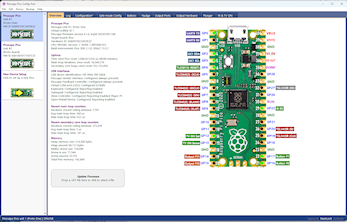
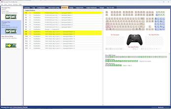

# Pinscape Pico

Pinscape Pico is a sequel to the original Pinscape virtual pinball
controller, redesigned for the Raspberry Pi Pico.

This is a new project, not a port of the KL25Z Pinscape software.  The
Pico is a more powerful platform than the KL25Z, so I wanted to make a
fresh start to take advantage of the Pico's expanded capabilities.
Pinscape Pico has all (I'm pretty sure) of the features of the
original KL25Z Pinscape, plus some neat new tricks.  It's also a
little more "technical" than the KL25Z system, especially at this
early stage in its development.

## Quick setup guide

A pre-built Windows installation is available on the github project page, 
under the **Releases** section in the right panel.  

The distribution is a simple ZIP file, and installation is just a
matter of unpacking the ZIP file into a local directory on your hard
disk.  The only caveat is that you should **not** use a folder within
the system Program Files tree, because Windows applies special write
protection to that whole tree.  Just about anywhere else should be fine,
such as a root-level folder (C:\PinscapePico, say) or a folder within
your personal C:\Users folder.

Once you unpack the files, you can launch the Pinscape Pico GUI Config
Tool by double-clicking **GUIConfigTool.exe**.  That's designed to be
your main gateway to the system.  The program will offer on-screen
instructions for setting up a new Pico with the Pinscape software.

More setup details can be found [below](#SetupDetails).

## Overview of features

* USB keyboard emulation, for button input mapping

* USB gamepad emulation, for button inputs, accelerometer, and plunger

* XBox controller emulation ("XInput"), as an alternative to the HID gamepad
(and the controller's feedback features (LEDs and rumble motors) can be mapped to
output ports via the "computed output" feature)

* [Open Pinball Device](http://mjrnet.org/pinscape/OpenPinballDevice/OpenPinballDeviceHID.htm) support

* All input devices (keyboard, gamepad, XBox, Open Pinball Device) are optional, they can be mixed
and matched in any combination, and and all of their virtual controls (buttons,
joystick axes) can be individually mapped to whichever physical inputs you like
(physical buttons, accelerometer axes, plunger sensor)

* Support for PWM outputs directly through Pico GPIO ports, as well as
multiple external PWM output controller chips (TLC5940, TLC59116,
PCA9685), and even shift-register chips (74HC595)

* Gamma correction option for PWM output ports, with the gamma
calculated at the device's full resolution for higher-resolution
devices (e.g., 12-bit gamma scaling for TLC5940)

* Configurable "flipper logic" timer protection (in software) for all output ports

* Support for shift register output ports via 74HC595, which can be configured
as digital ON/OFF outputs or as PWM outputs

* Support for digital ON/OFF output ports via PCA9555 GPIO expander chips

* An add-on project, "PWMWorker", turns additional Picos into 24-port
I2C PWM controllers, the equivalent of 1&half; TLC59116 or PCA9685
chips, but in the DIY-friendly Pico package, and at the DIY-friendly
Pico price point.  Add more PWM ports to your system, 24
at a time, without any SMD soldering ([Data Sheet](http://mjrnet.org/pinscape/PWMWorker/DataSheet/PWMWorkerDataSheet.htm) &bull; [Project subtree](PWMWorker))

* Support for button inputs directly through Pico GPIO ports, as well as through
74HC165 shift registers and PCA9555 GPIO expanders

* Extremely low latency on GPIO and 74HC165 input ports (microseconds on the
device side, 1-2 milliseconds end-to-end delivery to the application through USB)

* Ports on PCA9555 chips can be individually assigned as button inputs ports and
feedback device output ports, freely mixing port types on the same chip

* An extensible design for all of the external hardware interfaces, to allow
new chips to be added in the future

* "Logical button" design that allows mapping multiple types of physical inputs to
multiple types of PC inputs and other actions, including keyboard keys, gamepad buttons,
IR remote control code transmissions, and internal actions such as engaging Night Mode
or firing an output port

* Button macros, to carry out a timed series of actions when a button (physical or logical) is pressed

* "Shift buttons", to allow mapping multiple functions to a single physical input; multiple
shift buttons can be defined, to allow for shift "chords" (analogous to PC key combinations like Shift+Ctrl+X)

* "Logical output" design that allows mapping physical outputs to DOF ports, internal sources, and
"computed" sources that let you combine DOF ports, control multiple things with one DOF port,
control ports based on timed events or internal device events, and all sorts of other things

* DOF support, via Pinscape Pico device recognition in DOF (present in unified R3++ DOF releases since late 2024)

* Support for legacy LedWiz-only applications, via a new version of the open-source LEDWIZ.DLL
that adds Pinscape Pico as a recognized device type; the DLL presents the Pinscape Pico to
legacy applications as a virtual LedWiz, or even as a collection of virtual LedWiz units,
for Pinscape configurations with more than 32 output ports

* Night Mode, to disable designated outputs as a group for quieter play

* Time-of-day features, and support for an external real-time clock (RTC) chip to keep time
while the power is off

* IR remote control receiver/transmitter, with the full universal-learning-remote design from the KL25Z Pinscape

* The "TV ON" feature from the KL25Z Pinscape, with support for the same type of external power-sensing circuit,
and the same support for a TV Relay and IR command activation when a power-on transition occurs

* Plunger sensor support for all of the KL25Z Pinscape sensors, with the same plunger logic features

* Nudging, with support for multiple accelerometer chips (MXC6655XA, MC3416, LIS3DH, LIS3DSH),
with an extensible design to allow support for more accelerometer chips to be added in the future

* Nudge Velocity input support for the latest Visual Pinball

* Plunger and accelerometer inputs can be mapped to any suitable gamepad axes, and can also be used
as inputs to logical buttons and logical output ports; for example, you can set up a button that
triggers when the accelerometer X axis exceeds a given threshold, or set up an LED that turns on
when the plunger is pulled

* Plunger Velocity input support for the latest Visual Pinball

* Extremely flexible configuration system, with practically all of the
hardware setup under user control, using the human-friendly JSON text file format

* Detailed error/status logging, viewable on the PC via UART (physical serial port), USB CDC (virtual COM port),
and the Config Tool, for easier troubleshooting

* A simple command console, accessible through UART and USB CDC ports, with access to internal
debugging and troubleshooting commands; mostly a debugging tool for developers, but possibly useful
for troubleshooting problems that don't easily yield to other means

* GUI configuration and testing tool, with detailed visualizations of hardware
and software status for button inputs, feedback device outputs, plunger sensor, and IR features

## Documentation

The main documentation right now is the Config Tool help.  That has extensive
information on the Config Tool itself, with a lot of details on the how the
firmware works.  The JSON Configuration Reference section in particular has
extremely detailed information on all of the features, subsystems, and peripheral
hardware supported.

You can access this from the Help menu in the GUI Config Tool (GUIConfigTool.exe),
or you can simply open **Help\ConfigTool.htm** in your favorite browser.

In case you'd like to just read about the system without actually installing
anything, I've made the same help files available online, at
[mjrnet.org/pinscape/PinscapePico/Help/ConfigTool.htm](http://mjrnet.org/pinscape/PinscapePico/Help/ConfigTool.htm)

## More details on installation

### Initial Pico firmware installation

The Pinscape Pico Config Tool guides you through the initial setup process for a new
device.  Just run the program and follow the on-screen instructions under the "New
Device Setup" section.

If you prefer to carry out the steps manually, without the Config Tool involved,
you can also use the standard, native Boot Loader procedure you'd use with any Pico
software:

* Unplug your Pico from USB (and all other power sources)

* Press **and hold** the button on top of the Pico while plugging it in, then release the button

* You should see the Pico appear on your Windows desktop as a virtual thumb drive

* Drag and drop **PinscapePico.uf2** from the Pinscape folder onto the Pico virtual disk
(or use a COPY command in a DOS box)

The Pico should now automatically reboot into the Pinscape software.  If the
software is working properly, the little green LED on top of the Pico will
blink at about 1 Hz, and the device should appear as a Pinscape Pico unit
in the Config Tool.

After the initial install, you can install firmware updates directly
through the Config Tool without all of the manual steps.

### Configuration

This project's configuration setup is rather different from the KL25Z
Pinscape setup.  Instead of a graphical config tool, Pinscape Pico
uses a text file written in the widely-used JSON format.

The JSON file format and contents are documented in the Config Tool
help.  The Config Tool features an integrated text editor (based on
Scintilla) with JSON syntax-aware coloring and indenting, and
quick linking from the current editing location (based on live
syntax scanning) to the relevant documentation.

When you first fire up the GUI Config Tool and go to the Main
Configuration view, the program will offer a choice of initial
template configurations that you can use as a starting point.
The templates contain many examples of common configuration
elements, commented out, that you can un-comment and edit as
needed to add to your own configuration.

Alternatively, you can also send a config file to the Pico using the
command-line Config Tool, from a DOS box:

`ConfigTool --put-config MyConfig.json --reset`

Replace `MyConfig.json` with the actual name of your JSON file.  The
`--put-config` part installs your JSON file on the device.  The new
settings don't go into effect until you reboot the device, which is
why we also added `--reset` at the end.

### Firmware updates

You can update the firmware using the same procedure as the initial
install, manually forcing the Pico into Boot Loader mode and manually
copying the new UF2 file.  But there's an easier way: once Pinscape is
installed, you can use the Config Tool to do the transfer with a
couple of mouse clicks, with no need to physically unplug the Pico or
fuss with the BOOTSEL button.

In the GUI config tool, the main Overview window has controls for
updating the firmware.

To update the firmware from a DOS box, use the command-line config tool:

`ConfigTool --update=PinscapePico.uf2`

That automatically places the Pico into Boot Loader mode, copies
the specified UF2 file into its flash, and reboots the Pico to
launch the updated firmware.

## Recovering a bricked Pico

First, you can't actually "brick" a Pico, in the sense of rendering it
permanently unrecoverable due to a software error.  But the Pinscape
software certainly can crash, and it can crash at startup, such that
it won't connect to the Config Tool long enough to let you perform an
update.  So the Pico might *appear* to be bricked.  Even this is
unlikely, because Pinscape uses the Pico's hardware watchdog to
automatically detect most software crashes, rebooting the Pico
into "safe mode".  This bypasses the normal configuration loading and
thereby usually bypasses whatever triggered the crash.  This doesn't
necessarily solve the underlying problem, but it at least gives you
access the Pinscape software as far as updating the configuration
and firmware.

Even in the event that Safe Mode doesn't kick in, it's *still* essentially
impossible to truly brick a Pico, thanks to the Pico's boot loader
being etched into inalterable hardware ROM.  No matter how badly the
software screws up, there's just no physical way that it can break
the ROM.  If the Pinscape software ever makes your Pico appear unresponsive,
you can always restore it to Boot Loader condition as follows:

* Disconnect the Pico from USB (and any other power sources)

* Press **and hold** the BOOTSEL button on top of the Pico while plugging in the USB cable

Holding the BOOTSEL button during a power cycle activates the Pico
boot loader, bypassing any software loaded in flash.  Since it's
impossible to erase the boot loader program itself (as it's stored in
unerasable ROM), and since the BOOTSEL button physically bypasses the
flash during the reset, there's nothing that an errant firmware
program can do to derail this assertion of Boot Loader control.

After you perform the BOOTSEL maneuver, the Pico should appear as a
virtual thumb drive on your Windows desktop.  You can now replace the
flash firmware by dragging the new .UF2 onto the Pico thumb drive.

For most programs, it would be enough at this point to reinstall the
firmware.  However, that's not necessarily good enough with Pinscape,
because Pinscape *also* stores your configuration file in the Pico's
flash memory, in a separate area from the program executable.  You
can fully reset the Pico to factory conditions using the Config
Tool, via the Device menu on the main Overview page, or via the
Boot Loader view, if the device is currently in Boot Loader mode.

## Expansion boards

Pinscape Pico is designed to work with many different hardware
configurations.  It has drivers for multiple chips in all of the
categories important to virtual pinball cab builders: accelerometers,
PWM controllers, ADCs, GPIO extenders, shift registers (input and
output), plunger sensors, and more.  This makes it possible to use the
Pinscape Pico software in a wide range of hardware environments, from
a stand-alone Pico, to a solderless setup with QWIIC breakout boards,
to a custom circuit board.

As part of the Pinscape Pico project, I've developed a few custom
"expansion boards" purpose-built for virtual pin cabs:

* **DIY-friendly expansion board set:**  A two-board set, designed
  to work together as a unit, providing a complete virtual pin cab
  I/O controller powerful enough for a high-end build with just
  about every toy known.  "DIY-friendly" means that it's designed
  entirely from parts that are easy to source and easy to solder
  by hand - it's meant to be something you can build yourself.

* **"Pro" expansion board:** An all-in-one board with a similar
  set of features to the DIY-friendly set, just with everything
  packed into a single board, thanks to the higher density achievable
  with fine-pitch SMD parts.  I call it the "Pro" board not because
  it's any better than the DIY board, but just because it's not
  something that you can easily assemble by hand, thanks to the
  use of small SMD parts.  It's really only practical to assemble
  robotically.  This design is more economical than the DIY board
  for production in volume, so it might be something that one of
  our enterprising community members who's set up for retail sales
  might want to look into.

* **KL25Z adapter:** An adapter board that makes the Pico mimic
  a KL25Z, for use with the original Pinscape KL25Z expansion boards.
  This is designed for people that already have the KL25Z boards,
  and want to keep using them, but also want to upgrade to the new
  Pico software.  This is designed as a drop-in replacement for the
  KL25Z in your old setup.

But Pinscape Pico isn't limited to *my* expansion board designs.
The software is designed from the ground up to work with many
different peripherals, and it doesn't make any assumptions about
which peripheral devices are present.  It'll work just as well
with other people's expansion board designs as with my board designs.

## Pinscape Pico API for Windows applications

Part of this project is a C++ API for accessing a Pinscape Pico
device from a Windows application.  The API is packaged as a C++
static-link library (.lib) that you can include in any C++ project.
Refer to [WinAPI/README.md](WinAPI/README.md), and the source
files in the WinAPI/ folder.

### USB protocols

The Windows C++ API is built atop a set of documented, structured, and
extensible USB protocols.  You can access the device directly through
its USB protocols in cases where the Windows API isn't suitable, such
as from a Linux host, from another microcontroller, or from a Windows
programming system that can't readily import C++ APIs.  See
[USBProtocol/README.md](USBProtocol/README.md) for details.

## Building the project from source

A pre-built Windows distribution is available on the github page,
under the **Releases** section in the right panel.

If you wish to build the project from source, clone the github
repository to your PC.  (You can also download a snapshot of the
github code as a ZIP file and unpack it into a local directory on your
PC.)  The firmware and Windows tools use completely separate build
systems; see below for instructions for each.

### Building the Pinscape firmware

The firmware requires the Pico C++ SDK.  For most of the project's
development phase, I was using SDK 1.5.1; shortly before the first
release, I made the (perhaps risky) move of updating to the latest
SDK version, 2.1.0.  The firmware has been built and tested against
both of those SDK versions, so you can take your pick.  It's been
tested more thoroughly with the 1.5.1 SDK, but it seems pretty solid
with 2.1.0 so far, so it's probably better to use the newer 2.1.0
unless you run into a problem that you suspect is due to an SDK 
version incompatibility.

Raspberry Pi provided an official one-click Windows installer to
set up a command-line build environment for 1.5.1, at
https://github.com/raspberrypi/pico-setup-windows/.

For 2.1.0, Raspberry Pi has deprecated the Windows installer in
favor of a new Visual Studio Code extension, which in principle
should be easier to set up and use.  But at the moment, it seems
to be a work-in-progress, to such an extent that I can't get it
to even install on my system.  So I cobbled together my own 2.1.0
version of the command-line environment from the raw materials,
and I've made a self-contained snapshot of the result available at
https://github.com/mjrgh/pico-sdk-2.1.0.  This is for x64 Windows only;
if you want to build on another platform, you should go directly to
the Raspberry Pi official site for options.  My 2.1.0 snapshot is
just about as easy to set up as the official release 1.5.1 was, so it's
a good option if you run into the same problems I did with the official
VS Code extension for 2.1.0.  If you *can* get the VS Code version
of 2.1.0 to work, you might prefer that to my jury-rigged command-line
environment, especially if you prefer working in an IDE.

For any version of the SDK on Windows, you'll also need to install
Microsoft's NMAKE build tool.  That's not included in any of the
pre-built snapshots (mine or the official Raspberry Pi releases)
because it's proprietary Microsoft software - but Microsoft makes it
freely available, even though they don't let anyone else distribute
it.  The easiest way to get that is to install the free Visual Studio
Community Edition.

For tons of documentation about how to use the Pico SDK, see
[Getting started with Raspberry Pi Pico](https://datasheets.raspberrypi.com/pico/getting-started-with-pico.pdf).
That has instructions for setting up the build environment on other
platforms (Linux, MacOS) if you prefer to work on one of those.
But you won't need to read all of that if you just want to build the
Pinscape firmware, as the instructions below should cover it.
Note that this assumes that you've already set up the SDK tools
on Windows as explained above, and assumes that you're using the
command-line build process (as opposed to VS Code or some other IDE).

* Open a Windows Terminal window (i.e., a CMD prompt/DOS box)

* Set the working directory (`CD`) to your PinscapePico\firmware folder

* Type `c:\pico-sdk-2.1.0\pico-env.cmd` (replacing the path with the actual
location where you installed the Pico SDK files, if it's different)

* `del CMakeCache.txt` and `rmdir /s CMakeFiles` if those exist from previous builds

* Type `cmake -S . -G "NMake Makefiles"` (**exactly** as shown, including capitalization and quotes)

* Type `nmake`

That should produce a long series of progress messages from the compiler, hopefully
all bearing good news (no warnings or errors), and ultimately finishing with:

`[100%] Built target PinscapePico`

You should now see a file in the working folder called `PinscapePico.uf2`.  That's
the compiled firmware program, ready for installation onto your Pico.  Install
this on the Pico using the standard procedure for all Pico firmware installs:

* Unplug the Pico from USB (and all other power sources)

* Press **and hold** the button on top of the Pico while plugging in the Pico's USB cable, then release the button

* Copy the UF2 file onto the Pico's Boot Loader virtual thumb drive

### Building the PWM Worker firmware

There's a separate firmware program, called PWMWorker, in another folder
(of that name) alongside `firmware`.  This program is designed for use with
the DIY-friendly expansion boards, which use auxiliary Picos to perform the
job of controlling PWM outputs, which we might otherwise do with a dedicated
PWM chip like a TLC59116 if any such chips were available in a DIY-friendly
package.  But all of the PWM chips on the market today are fine-pitch SMD
chips that are difficult to solder by hand, so we use Picos instead.  To
make the auxiliary Picos act like PWM controller chips, we install this
special firmware.

You can build this firmware using the same procedure outlined above
for the main Pinscape firmware.

### Building the Windows programs (GUI Config Tool, Command Line Config Tool, API libraries)

All of the Windows programs can be built through a single Visual Studio "solution" (.sln)
file.  The process is fully automatic once you load the .sln into Visual Studio.

* Install Visual Studio 2022 or later.  Community Edition is free;
download it from the official Microsoft site at https://visualstudio.microsoft.com/vs/community/.

* Launch Visual Studio

* Click **Open a project or solution**

* In the file selector, navigate  to your PinscapePico folder, and select **PinscapePico.sln**

* Select **Build** > **Build Solution** on the main menu

## Command Console

The firmware provides a very simplistic command console that provides
access to some internal debugging and troubleshooting information, which
is designed entirely for use by the developers, so it's not designed with
user-friendliness foremost in mind.  However, it might be useful for
in-depth troubleshooting, and might be of passing interest to the curious.

The console must be enabled explicitly, since it requires a serial connection
of some kind, either UART or USB CDC, which consumes some resources on the
Pico.  The console also consumes some additional resources of its own.  See
the Config Tool help section on the JSON configuration for details on
setting up serial port access and enabling the console.

Once enabled, you can access the console via a terminal program such as PuTTY.
Connect PuTTY (or other terminal program of your choice) to the Pico's COM port
(real or virtual).  You should be presented with a command prompt.  Type
`help` for a list of commands.  The console provides simple tab-completion
for commands and option flags.

## Background

The original Pinscape software runs on the NXP FRDM-KL25Z, a
microcontroller based on the Arm M0+.  The KL25Z was marketed primarily
as a development platform for NXP's Arm CPUs, but in many ways, it was
an ideal platform for something like Pinscape: it has a
generous complement of GPIOs, an excellent MEMS accelerometer on
board, built-in USB, an integrated high-resolution ADC, and on-chip
peripherals for all of the common peripheral interconnects (UART, SPI,
I2C).  It has almost everything you'd need for a virtual pin cab
controller built into the board; the only thing that pin cab builders
had to add externally was MOSFET drivers to switch high-power devices.
In a full system, we also had to add external PWM controllers, since the
KL25Z didn't have as many PWM control channels as are needed for a
typical virtual pin cab.  The KL25Z was also quite reasonably priced,
at under $20 MSRP.

But alas, NXP hasn't produced new KL25Z units since around 2018, and
most retailers that sold them ran out of inventory around 2021.  It's
been getting increasingly difficult to find them available for sale in
the years since.  Sellers who do have them know how difficult they are
to find and are asking ridiculously high prices for them, as much as
5X MSRP.  The Pico, in contrast, is amply available, and Raspberry Pi
has publicly committed to keeping them in production for many years
to come.  (Raspberry Pi also recently released the Pico 2, an updated
version with an even faster CPU.  That will extend the life of the
product family even further.)  The Pico is also even less expensive
than the KL25Z was, at just $5 MSRP.

Like the KL25Z, the Pico based on the Arm M0+ CPU core, but that's
about the only thing that the devices have in common technologically.
Arm's CPUs are designed to be customized by the OEM, so the M0+ from
NXP and the M0+ from Raspberry Pi are quite different, sharing a common
machine code language but not much else.  The Pico's version doesn't use
any of the same on-chip peripherals as the KL25Z.  It does provide many
of the same peripheral *functions* that the KL25Z did, at a conceptual level,
including GPIOs, DMA, ADC, USB, I2C, SPI, and UART, but the concrete
implementations are very different in the details from their
KL25Z counterparts, so code written for one machine needs to be largely
rewritten to run on the other.  The Pico also lacks an accelerometer, which is a
key feature for a pin cab controller.

Because of the differences in capabilities, the Pico requires not only
a whole new software port, but also a whole new external hardware
environment, to fill in the gaps in the Pico's peripherals vs the
KL25Z.  We obviously have to add an accelerometer, but we also have to
compensate for the relatively small number of GPIOs on the Pico relative
to the KL25Z - we can't just wire 20 or 30 button inputs to GPIOs, which
we could get away with on the KL25Z with its 50+ ports.

What the Pico lacks in on-board peripherals, it more than makes up for
with excellent hardware support for external peripherals.  The Pico
has a novel and extremely flexible hardware subsystem that makes it
possible to interface to a wide range of external devices with minimal
CPU load.  Pinscape Pico takes advantage of the Pico's unique hardware
to provide support for large number of external peripherals, with
extremely flexible configuration options.  It offers several different
ways to attach huge sets buttons and outputs with only a few GPIO
ports; it supports multiple accelerometers, with an open architecture
that will allow expanding to new devices in the future; it supports
multiple external ADCs to supplement the somewhat meager on-board ADC.

## How Pinscape uses the Pico's flash memory

The standard Pico boards come with 2MB of flash memory built in.  The
flash chip is there primarily for storing the user's firmware program,
and the Pico's designers didn't really make provisions for any other
use.  In particular, they didn't bother putting a "file system" on
the flash; it's just a big unstructured byte array, like an
unformatted disk drive.

It might *look* like the Pico has a FAT file system on the flash,
because the Pico pretends that it's a FAT-formatted thumb drive when
you put the Pico in Boot Loader mode.  But it's a carefully crafted
illusion.  The thumb drive you see isn't actually a window on the
flash memory, but more like a virtual in-memory RAM disk.
Importantly, it can't actually store regular files.  The only thing it
can do is accept a UF2 file, which it parses into a Pico program image
that it installs into the flash memory space.  If you try copying a
regular text file or a Word document or anything else onto the drive,
it won't stick, since the virtual thumb drive's only job is to install
program images from UF2 files.

Even though the flash memory space is so completely raw and
unstructured, the Pico Boot Loader's usage of the space is at least
predictable.  The Boot Loader always installs the program image at the
"bottom" of flash (the lowest memory address), in a contiguous block
equal to the size of the image.  This predictability is what allows
Pinscape to share the flash space with the program image, to store its
own persistent application data.  Pinscape simply uses a portion of
flash at a safe distance from the bottom section where the program
image goes (all the way at the opposite end, in fact, at the "top" of
the flash space).  Pinscape uses this capability to store your
configuration file and other settings, such as plunger calibration
data.

Even though the Pico itself doesn't have any structure for its flash,
Pinscape itself adds its own file-system structure, using the high
end of the flash space (at the opposite end from the firmware program
load area).  The file storage area is intended only for internal use
within the firmware, so it's not exposed as general-purpose storage
for user access, but the command console has some simple tools that
can access it for development, debugging, and troubleshooting use.

## License

Copyright 2024, 2025 Michael J Roberts

Released under a BSD 3-clause license - NO WARRANTY

## Third-party software credits

CRC++, Copyright (c) 2022, Daniel Bahr.  Distributed under a BSD
3-clause license.

Pico C++ SDK, Copyright 2020 by Raspberry Pi (Trading) ltd.
Distributed under a BSD 3-clause license.

Scintlla Edit Control, Copyright 1998-2021 by Neil Hodgson
<neilh@scintilla.org>.  Distributed under a custom Python-like
license; see Scintilla/License.txt in this source
tree for the full license text.

